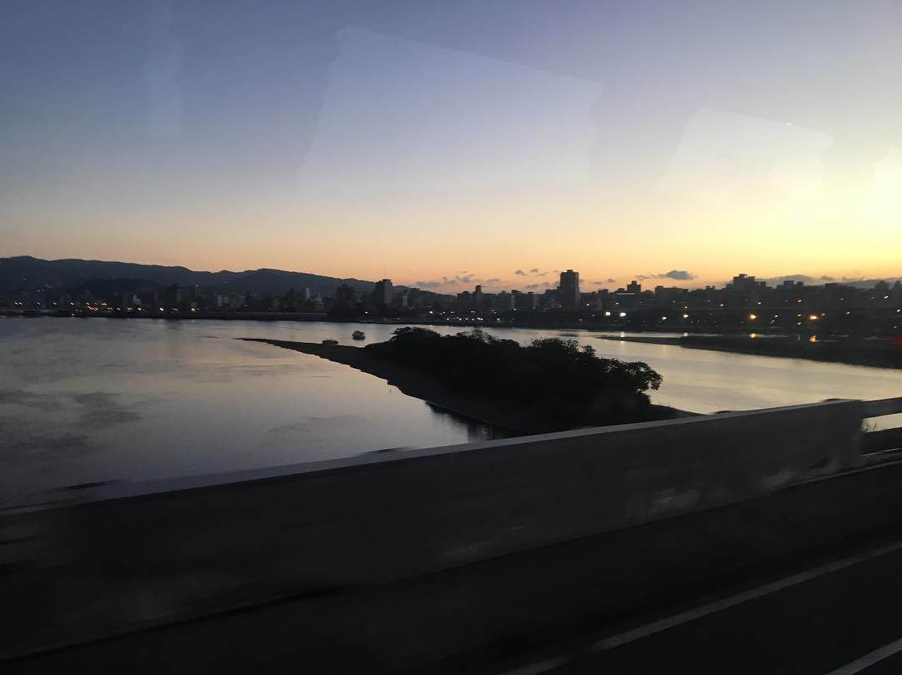

悠悠轉醒的臺北城，南下的第一班車發動，離根生的眷戀愈來愈遠，卻離未知的夢想愈來愈近。

闔起雙眼，彷彿是昨日才踏上這座車水馬龍的水泥叢林，匆促擁擠的步調令我陌生，在我成長的土地上，我卻像個異鄉人，但當我踏入家門，一切的熟悉像是出竅的靈魂般回歸，父母親永遠在這裡等著我，很多事我還來不及做，就一一幫我打點的妥貼，切好的水果、溫好的早餐、洗好的衣物、收好的行囊。

回到了家，我永遠是那個長不大的孩子，原來真的成為了異鄉遊子，才明白這十幾年來自己的不成熟。

下個禮拜又要回來了，我會收起那些近鄉情怯，告別今年的種種，與自己明年再見。

:::note 來自 2025 的感想
一早坐客運回雲科時有感而發，我記得當天王雅夫也搭同一班車
:::
