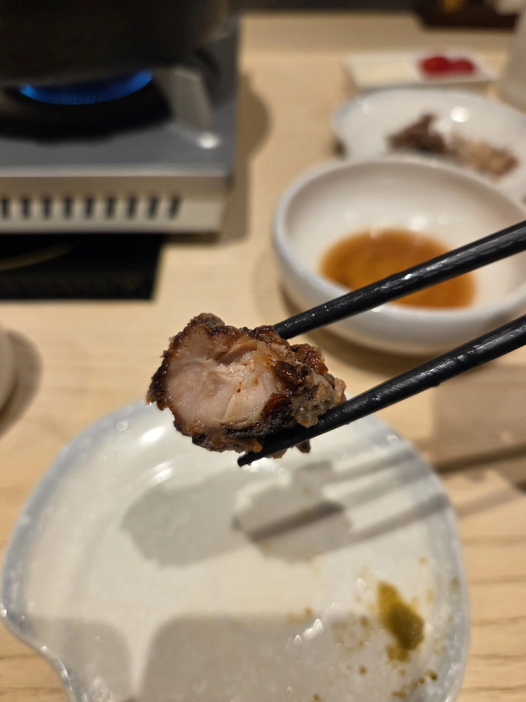

# 蝦波生日約會

好幾個月前就預訂了 [博多味処](https://hakata-iroha.net/cn/about.php)，本店在福岡，水炊鍋與和牛壽喜燒名店。

## 水炊鍋

湯頭很棒，清甜爽口，再加上一點點柚子胡椒，又是不同的口味。雞肉是有點嚼勁的土雞，肉香濃郁的類型，不得不提雞肉丸，非常鬆軟，入口馬上就化開了。

## 炸雞

醃料非常特別，炸到金黃微黑，裡面鮮嫩多汁。

 ## 和牛壽喜燒

先在鍋底用牛油潤鍋

加入砂糖炒過

再將和牛入鍋

加入日式醬油與牛奶酒

搭配生食雞蛋享用

比起用炒的作法（風味更甜一些，被醬汁包裹的口感）我更喜歡用涮的方式，將熟度控制在五分左右，肉質更軟嫩。壽喜湯頭裡的蔬菜、烏龍麵跟菜盤我就覺得一般般，不如水炊鍋清甜湯頭煮出來的菜。最後還有用水炊湯頭煮的雜炊稀飯（但已經吃飽了於是外帶）

## 甜點

甜點是焦糖布丁與水信玄餅搭配柚子醋冰沙

整體價格偏高但是用餐體驗也很棒，服務很周到，可以吃得很飽，適合放鬆吃專注聊天的約會場合。

>個人排名：五分熟和牛>雞肉丸>炸雞>水炊鍋湯頭
>>主觀評分：4.5 

