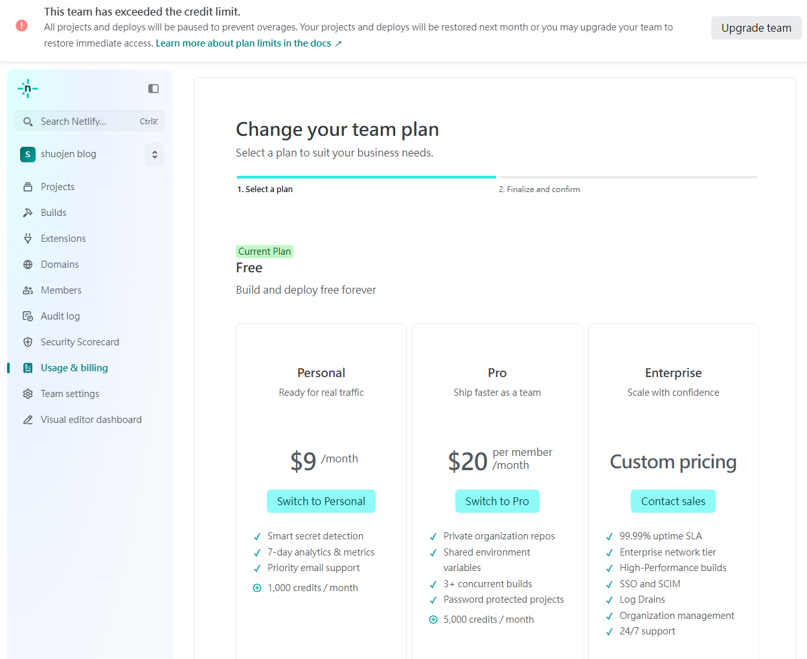

今天在設定部落格的時候，一直無法實現自動部屬，覺得很奇怪就察看一下

> Netlify:
>> This team has exceeded the credit limit. All projects and deploys will be paused to prevent overages. Your projects and deploys will be restored next month or you may upgrade your team to restore immediate access.
>> [Learn more about plan limits in the docs](https://docs.netlify.com/manage/accounts-and-billing/billing/billing-for-credit-based-plans/how-credits-work/)

哇~我才使用一個禮拜的時間而已就必須升級專業會員了，我這個小小的靜態網站應該也沒多少部屬的流量吧，大公司的服務真的是很恐怖呢，隨時都可以決定遊戲規則跟用戶們收取費用。

目前先轉移陣地到 [Cloudflare Pages](https://pages.cloudflare.com/) 試試看，不是不願意付費，只是 Netlify 吸血速度讓用戶的觀感也太差了吧，可惜現在能力不足，架設主機自行部屬網頁對我來說還是太困難了，慢慢解鎖技能中......