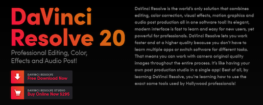

由於電腦前陣子重灌，想要找新的剪輯軟體，沒想到發現[DaVinci Resolve](https://www.blackmagicdesign.com/cn/products/davinciresolve)竟然是免費的，一直都知道達芬奇是功能非常強大的剪輯軟體，完全不知道有免費的版本，下載來玩看看吧，我的剪輯需求很低，免費版應該就很夠用了。

原本是要找開源的自由軟體[^1]的，不過達芬奇實在太香啦，只好先玩看看，希望以後的我不要後悔沒在一開始就習慣用自由軟體。

[^1]:[允許使用者自由地使用、複製、研究、修改和分發的軟體](https://zh.wikipedia.org/zh-tw/%E8%87%AA%E7%94%B1%E8%BD%AF%E4%BB%B6)