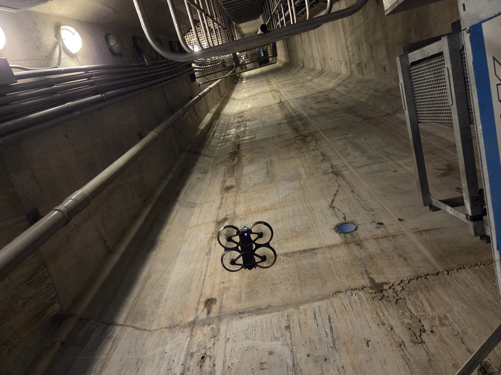

今天難得離開辦公室公出，騎車來到[新北大橋](https://zh.wikipedia.org/zh-tw/%E6%96%B0%E5%8C%97%E5%A4%A7%E6%A9%8B)做橋梁目視檢測[^1]，主要用空拍機針對橋面板底、橋墩及帽梁巡視並錄製空拍影片。

從內湖騎車到三重，攝氏36度的豔陽天，天氣超級熱。

第一次飛空拍滿緊張的可是很好玩。

接著前往橋塔做檢測

想不到吧，上圖中的對稱單橋塔裡面其實是空心，有許多管線與設備需要定時維護。

欣賞一下美景準備下班，推薦大家有時間，也可以在橋下停好機車，走上來瞧瞧逛逛呦。

[^1]:[直接目視或間接目視方式檢測橋梁構件是否有裂紋等損壞情形](https://oram.tycg.gov.tw/cp.aspx?n=9241)

