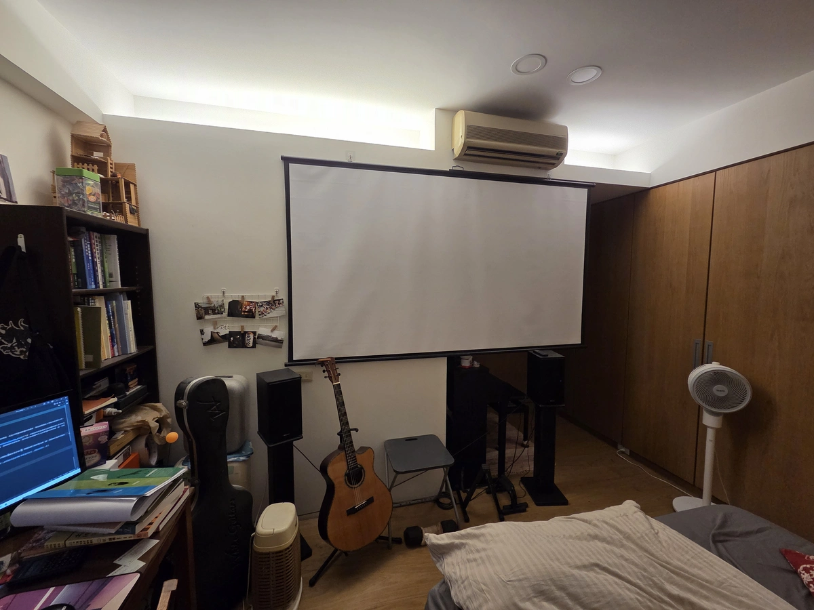

## 電影列表想法 
最近突然想到一個煩惱，每個週日夜晚總會上演一齣內心大戲：『今晚看什麼？』，總是既期待又害怕受傷害，沒有信心帶著失望 迎接禮拜一的上班日。

於是我決定設置一個電影列表，紀錄我所有看過而且很喜歡的愛片分享給大家，讓大家只要打開這份清單，就可以從備註的描述中挑選一部順眼的電影欣賞，當然我不能保證所有人欣賞電影的品味都一致，只希望大家可以看得開心，抱著愉快的滿足感入睡。

快來看看吧！[精挑細選的愛心片單](https://shuojen.site/docs/movie_list)[^1]。

## 觀影配置
順便跟大家分享我目前的觀影配置，我把房間佈置成小小電影院(躺著看才爽！)，偶爾找兩三個好朋友擠一擠，看恐怖片也很有氣氛。
配置大概像是這樣

* 投影機：JMGO N1S Ultra
* 投影幕：100吋 16:9白玻纖布幕
* 電視配件：Google chromecast 4k [^2]
* 音響：Klipsch R-51PM
* 片源：Netflix、Disney+、HamiVideo、My video

關於觀影平台，前兩個服務電影比較少，劇集或是紀錄片比較多。喜歡看電影的人我很推薦HamiVideo，或是Myvideo都可以單次付費觀看，片源比前面兩個充足，有些老電影都找的到，真的找不到片源也推薦收藏DVD呦，喜歡的電影值得永久收藏在自己的櫃子或硬碟裡。

[^1]: 電影列表在興趣區裡可以找到，絕對值得你一看！
[^2]: 兩年前在淘寶購入投影機，當時台灣還沒有代理，所以另外買了Chromecast支援台灣常見串流服務。
