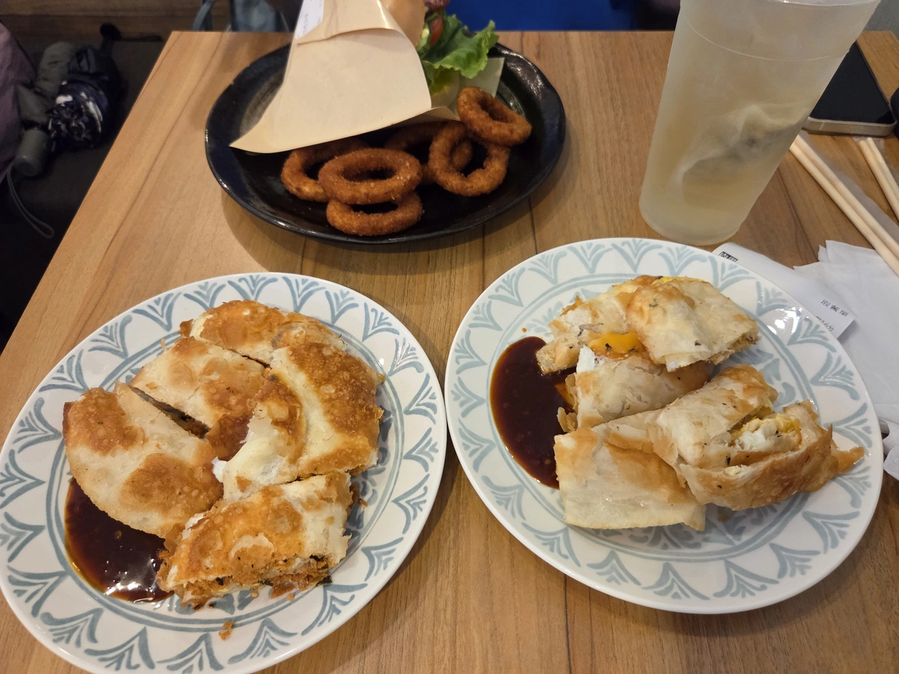

## 早餐店推薦 
今天來推薦喜歡的早餐店，通常周末我都會 10~11 點左右吃一頓早午餐，

這樣兩餐一起吃可以省一頓的熱量。

這間是國父紀念館站壹號出口的[壹號出口](https://maps.app.goo.gl/idev52Jw7ssTgvUg7)[^1]

推薦他的脆皮蛋餅，喜歡吃辣的一定要請老闆幫你加辣醬油膏，微微的鹹香辣感，很好吃。

也推薦加套餐，有薯條、雞塊、洋蔥圈套餐，搭配一個無糖的洋甘菊茶，滿足的早午餐。

[^1]: 推薦早上十點就過來，不然可能要排隊呦