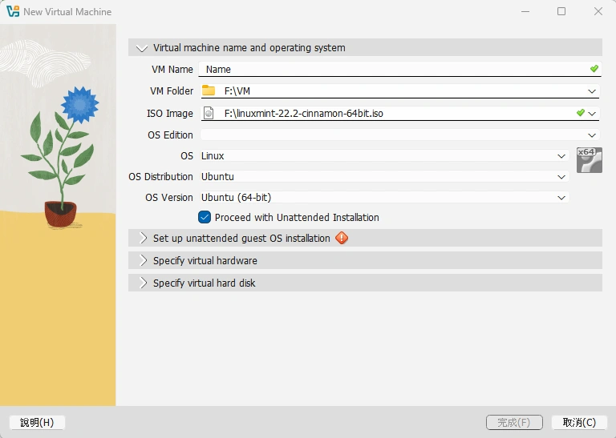
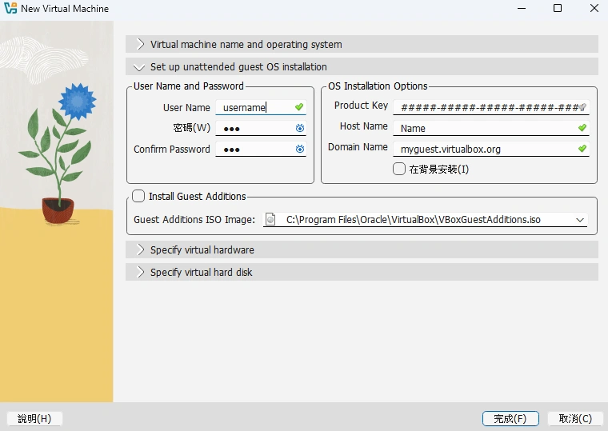
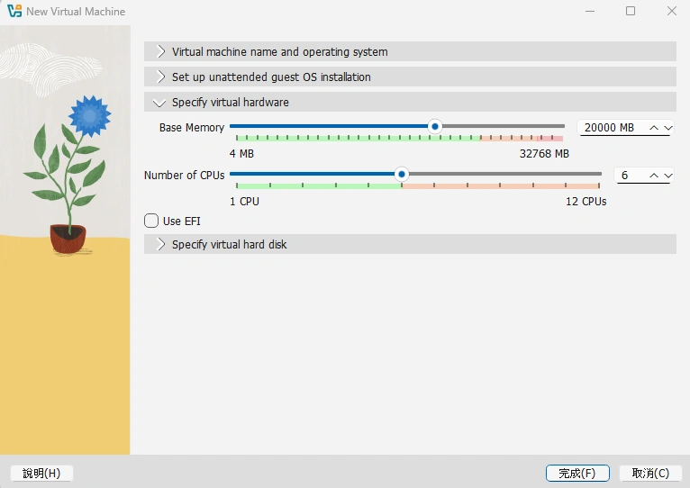
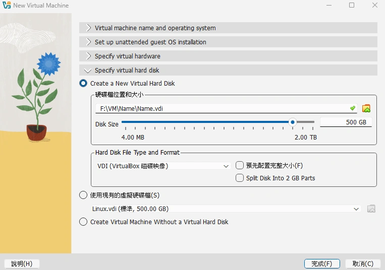
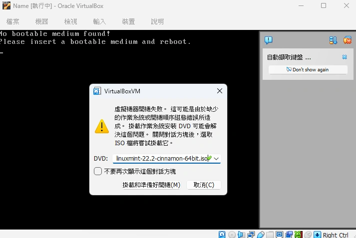
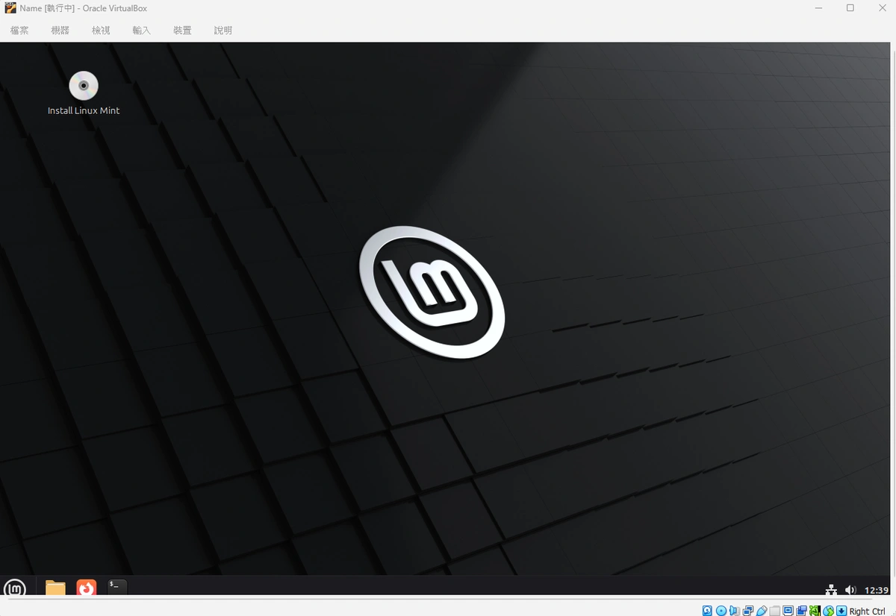

## 作業系統
前陣子我談了關於土木產業中作業系統與[軟體](https://shuojen.site/blog/2025/09/18/civil_software)支援的問題，經過幾天的摸索和找資料，現在我有個超級簡易的方法可以讓你安裝無數個系統慢慢玩個夠。如果你也想要開始嘗試看看自由開源的 Linux 系統，但礙於軟體相容或是其他原因無法執行。今天我來分享這個折衷的方式，只要簡單四個步驟即可，有興趣的話來試看看吧。

## 虛擬機
先介紹一下什麼是虛擬機？顧名思義就是一個存在你電腦裡的虛擬主機，就像一部全新的電腦，你可以自由的決定要分出多少現在主機上的性能，在上面跑另一個系統，安裝設定很容易，也可以輕鬆的移除掉，如果你對不留後路的重灌原系統有點害怕的話，非常推薦可以先從虛擬機嘗試看看！

## 安裝步驟說明

### 第一步
下載 [Oracle VirtualBox](https://www.virtualbox.org/wiki/Downloads) 虛擬機，它的核心是免費開源的自由軟體[^1]。

### 第二步
下載一個你想要安裝的系統 iso 檔（Windows、Linux）都可以

我選擇入門的是 [Linux Mint22 Cinnamon Edition](https://linuxmint.com/download.php)。

### 第三步
新增並設定虛擬機
1. 輸入 VM Name（虛擬機的名字）。
2. 選擇 VM Folder（虛擬機的儲存位置）。
3. 選擇 ISO Image（剛才下載的系統檔）。
4. 勾選 Proceed with Unattended Installation（自動安裝）。

5. User Name （輸入你的系統名字）、密碼（輸入你的系統密碼）。

6. Base Memory、Number of CPUs（選擇想要分出多少記憶體及 CPU，推薦拉到綠色區域）。

7. Disk Size（輸入你的系統硬碟大小，例如 500 GB）。

8. 完成後啟動虛擬機。
若出現以下畫面，再選擇剛才下載的 iso 檔即可。

### 第四步
完成你的 Linux 系統安裝，並可以無負擔地享受這個全新的開源系統啦！

[^1]: 商用擴充功能等目前為甲骨文公司所開發，需要商業授權。