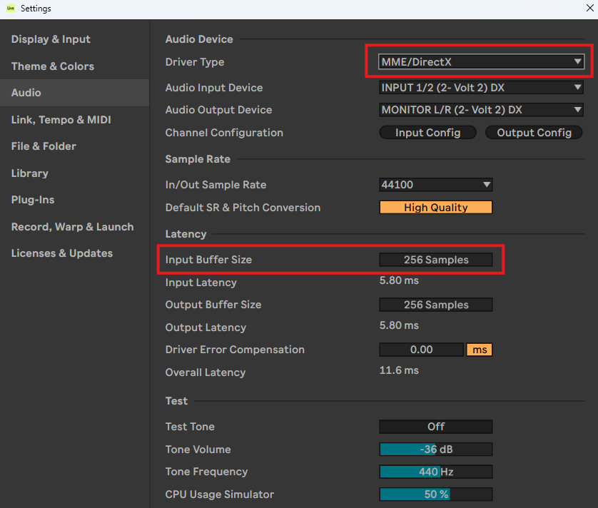
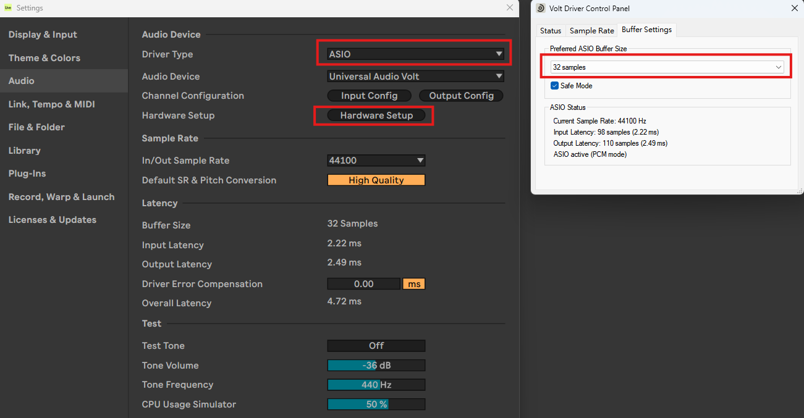

由於這陣子我把以前[彈吉他](https://shuojen.site/docs/music/guitar)的錄影片段放進這個部落格，今天久違的拿出電吉他，發現我有點忘記怎麼設置，於是今天來回憶並且把重點筆記起來，如果有更好的設置方式或是有趣的操作非常歡迎跟我說。

首先我想要直接將吉他聲音內錄進電腦裡，並且平常練琴也只想戴耳機，所以我放棄買真的吉他音箱，轉而購買錄音介面，吉他音色就依靠免費的吉他軟體效果器，達到虛擬吉他音箱的效果，同時搞定錄音需求。

## 流程介紹

將電吉他接上錄音介面後，開啟錄音軟體(DAW)，進入Setting-Audio(不同軟體應該大同小異)，這裡會看到預設的Driver Type是MME/DirectX，這個模式下會讓下面的Input Buffer Size最低只能調到256，Buffer Size設定越小，可以讓電吉他的聲音有更小的延遲，通常設置到32，就可以達到聽起來正常的練琴效果，不會感覺到太多的延遲，不過會讓CPU有比較大的負擔，電腦設備稍微差一點的，可以把其他程式都盡量關掉。

這裡我們將Driver Type設置為ASIO，看到系統抓到錄音介面後，選擇Hardware Setup，就可以選擇較低的Buffer Size了。

如果想要練習電吉他SOLO，利用[yt-dlp](https://github.com/yt-dlp/yt-dlp)工具，就能夠下載mp3檔案，基本的mp3下載指令非常簡單，在終端機中輸入`yt-dlp -x --audio-format mp3 "影片網址"`，就會下載到終端機當前所在的資料夾。

下載完成後將檔案拖曳進去DAW，設定好BPM，就可以盡情的練習啦。以下是我用普通電腦喇叭直出，並用手機直接錄影的模擬練習效果。

<video controls width="320">
    <source src="/video/008.mp4" type="video/mp4" />

    抱歉，您的瀏覽器不支援內嵌影片。
</video>

如果想要最好的錄影效果，將相機架設好錄完影，利用剪輯軟體將DAW輸出的聲音檔案取代影像音檔，就完成一個只有音樂原聲的演奏影片啦。 ~~(缺點就是很麻煩)~~

## 設備列表

* 吉他：Squier Affinity Telecaster 
* 錄音介面：Universal Audio UA Volt 2 
* 麥克風：鐵三角ATR2100x動圈麥克風
* 耳機：Sennheiser HD 599 SE
* DAW：Ableton Live Lite
 