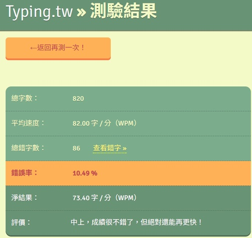

## 打字測試

今天看了JN寫的這篇[文章](https://blog.giveanornot.com/trying-boshiamy/)，
非常好奇於是測試了自己的中打速度，我使用的測試網站是[Typing.tw](https://typing.tw/app/?action=setting)，使用隨機文章測驗10分鐘，比照實際中打測驗[^1]的規則，長時間的結果也會更為準確。

結果我發現自己注音輸入法用的是出奇的爛。由於題目是散文，內容比較多艱深的生僻字，導致選字異常困難，我打了一分鐘就馬上更改策略，直接略過錯字。但是結果錯誤率暴增，而且速度其實也滿低的，這讓我燃起了對嘸蝦米這種拆字輸入法的興趣。

## 嘸蝦米輸入法

今天是我學習嘸蝦米輸入法的第一天，今天把「形」的部分記的差不多了，還滿有趣的，推薦想要試試看的人，可以到官方網站下載試用版本，也可以在網站上進行字根練習，學成後就再也不會有打錯字的窘境了。

我參考的是嘸蝦米發明者[劉重次](https://zh.wikipedia.org/zh-tw/%E5%8A%89%E9%87%8D%E6%AC%A1)先生的[教學影片](https://youtu.be/ieiDbPW6xF8?si=5ANfbtdImMlIfh2z)，他解說的十分清晰明瞭，只是需要時間好好練習，假如我學成之後再來分享我的學習歷程跟心得。

### 學習資源

1. 嘸蝦米輸入法[官方網站](https://boshiamy.com/)：下載輸入法及進行字根練習。
2. [嘸蝦米查碼網站](https://boshiamy.then.tw/)：用英文輸入法就可以體驗嘸蝦米，字根查詢功能很好用。

:::note
這篇文章的標題跟第一行是用嘸蝦米打字的，但是我怕我打到早上還寫不完只好暫且作罷。
:::

[^1]: 網路上有只打單詞的中打測試，通常注音輸入法都會自動辨識，灌水程度太高，孱弱如我都可以打到130wpm。