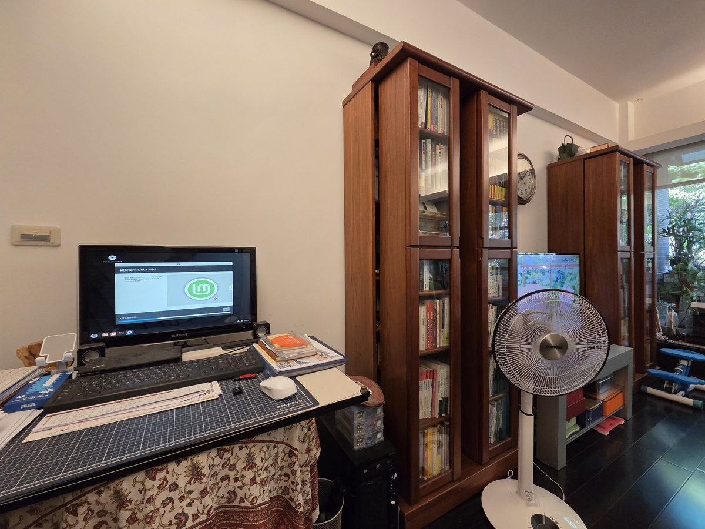

家裡客廳的台式電腦是大約 15 年前的套裝機，前幾年我回台北，幫它換了一顆 256 GB 的 SSD，還有將舊的 Nvidia 1060 裝上去，又存活了好些年。目前用一條 Hdmi 線連到客廳的老 SONY 電視，讓它擔任電視盒子的工作，可惜三代的 intel i5 跟 4 GB 的 DDR3 記憶體已經負荷不了 Windows 系統的摧殘了，於是今天徹底的重灌，用 Linux 讓它繼續勤勤懇懇的為家裡服務。

現在我爸媽只需要開機，點擊桌面上的 Brave 瀏覽器，就能繼續絲滑的觀看 Netflix 了，讓六十多歲的長輩使用 Linux 作戰，大成功。

