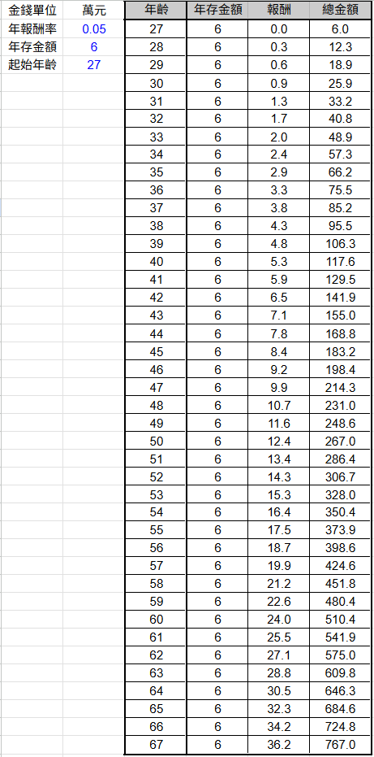

今天來用五分鐘的時間，國小程度的試算表，試算現在開始投資到退休時的投資計畫。

## 股市投資

假設我們每年撥出一定的金額，固定投入指數型 ETF，並且假設每年固定年化報酬率，試算四十年後，身上有多少存款，以及被動收入夠不夠支持開銷所需。

## 舉例說明

### 例子一
假設我是一個畢業當完兵的社會新鮮人，在二十七歲那年決定開始儲蓄，每個月收入扣掉支出，能固定儲蓄五千元投入股市，在六十五歲退休時，身上會有六百八十四萬元，並且每年帶給我三十二萬元的被動收入。

### 例子二(例子一支線)
假設我是剛才例子一的社會新鮮人，在二十七歲那年決定開始儲蓄，每個月收入扣掉支出，能固定儲蓄五千元投入股市，在四十歲時，我決定離職去賣雞排，我花了存下的一百萬元創業，在剛開始的頭兩年我僅能維持自己的基本開銷，後面開始穩定後，我每個月能夠存下兩萬元投資股市（隨意舉例，真實情況請自己謹慎評估）。

可以看到自己如果做了不同的人生選擇，如果順利按照自己的計畫進行，得到的回報是否值得。

## 結論
越早開始做好財務規劃，對未來絕對更有幫助，種一棵樹最好的時機是十年前，第二好的時機，是現在。

只要用國小程度的試算表，就能夠體會到複利這個世紀第八大奇蹟的威力，來試試看吧！

## 使用說明

1. 最簡單的用法，填入三個藍色數字即可，分別對應年報酬率、年存金額、起始年齡。
2. 可自行更改每年的存錢金額，總金額也可以在儲存格公式後進行加減。
3. 預設表格為起始年齡往後四十年，可自行增減。

歡迎點擊下方連結，複製一份專屬的 Google sheet 版本來試用！

<a href="https://docs.google.com/spreadsheets/d/1Pq7z3FZvJPz1hqvTw9iTz74fDlCOIJY3sDgYi_umYzA/copy" target="_blank">複製一份試算表範本</a>

也有毋須登入的網頁版本可以使用看看！

[複利成長試算表網頁版](https://joker123911.github.io/Shuojen-blog/calculator.html)

:::caution 提醒
實際上最困難的部分，是以下幾點：
1. 規劃自己該用什麼樣的資產配置（雞蛋不能放在同個籃子裡）。
2. 留好預備金，永遠幫自己找好退路。
3. 用不影響正常生活的錢做投資。
4. 金錢是讓人有選擇的自由，而不是滿足無限的欲望。
:::

希望每個人都能過上自己嚮往的生活。

