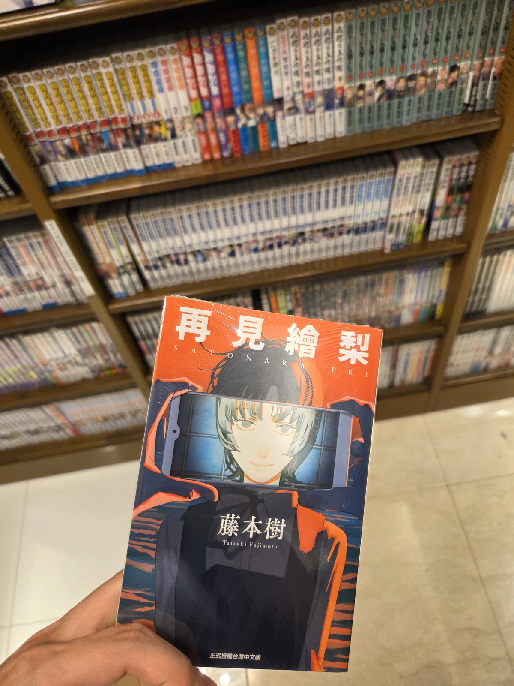

## 下班逛街
今天是連假前的最後一個上班日，下午四點我和同事哲哲換了對休，提早躲避下班人潮，一起跑去東區逛街。明耀百貨六樓的淳久堂書書局非常好逛，這裡很多有質感的日文原文書籍、漫畫可以收集，也有繁體中文的翻譯版。由於前幾天跟蝦波去看了《鏈鋸人-蕾潔篇》，深深被藤本樹的文本和角色刻畫給吸引，於是今天看到藤本樹老師的短篇作品《再見繪梨》[^1]，毫不遲疑的就入手了。

## 無雷心得

看完後先說結論，我非常推薦。藤本樹對短篇作品的掌握真的很細緻，不論是最近的《鏈鋸人》或是另一部很棒的作品《驀然回首》，都能看出在分鏡上的用心，利用細微的線條變化和視角停留，賦予讀者很強的電影感。藤本樹十分擅長角色的描繪，隨著劇情推動注入這些角色靈魂，讓你為他們感到不捨、惋惜與心疼。《再見繪梨》述說的是一個國中生為即將去世的母親拍攝電影，由此後來發生的一連串故事，好幾個橋段和轉折手法都很高明，讓你摸不清虛實與第四面牆的分界，探討人們應該對於親近之人的離去該留下怎麼樣的記憶。

藤本樹在《鏈鋸人》的特典訪談中提到：

>我很著迷於「戀愛對象變成一種詛咒般的存在長久持續」的感覺。如果看過《蕾潔篇》的各位，可以讓「蕾潔」這個存在能夠揮之不去地，作為詛咒永遠留在心中的話，我會很高興。

不難感受出藤本樹的作品為何都會這麼深刻的原因，《再見繪梨》中的繪梨、《驀然回首》中的京本、《鏈鋸人》中的蕾潔，藤本樹用盡一切的手法鋪墊，讓你迷上這個複雜又立體的角色，最後的最後，讓那個角色像陷入肉中的刺一般，永遠長存在你的心底。

總之，這幾部作品都很推薦，尤其《鏈鋸人》還在大螢幕上，快去美麗華杜比影廳訂位吧！

[^1]: 打完折才新臺幣 99 元，就能擁有這麼棒的作品實在太幸福了。
