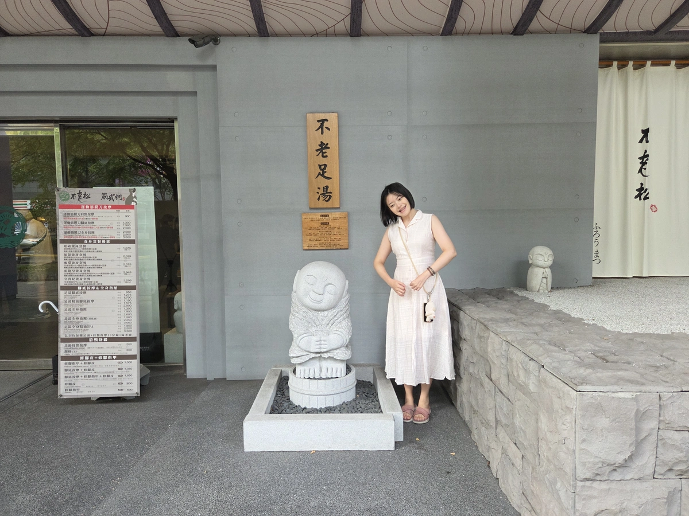
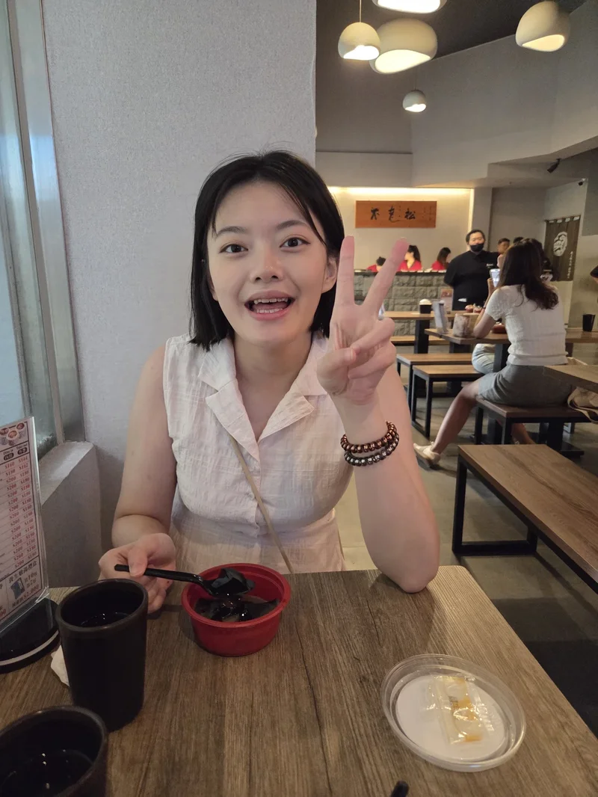
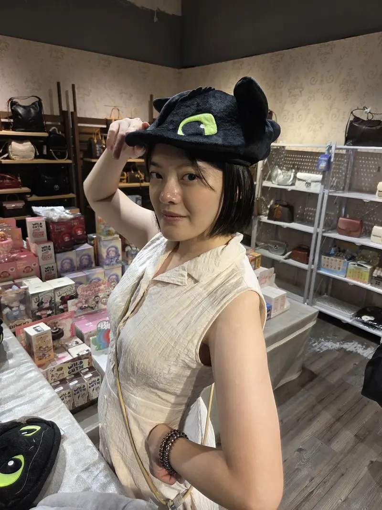

今天跟蝦波下午散步二十分鐘到不老松做腳底按摩，在大安高工旁邊，畢業後好久沒來這附近了，真懷念，不過發現這裡的店家好像和以前都不太一樣了。

進到店裡我們直接現場候位，不老松裡面環境舒適，坐著跟蝦波玩玩手機上有趣的 2 Player Games，約半小時左右很快就到我們了。一開始先選藥包泡足湯，師傅們會按按肩頸約十分鐘，再到裡頭的房間做腳底按摩，40 分鐘的方案大約全程有接近一小時，師傅們也都很專業，還滿推薦大家偶爾來放鬆一下，結束後還招待龜苓膏和青草茶呦。

最後散步回家在地下街看到沒牙的帽子，教大家一個省錢妙招，拍張照片就會感覺自己已經擁有它了，因為這種可愛但不實用的東東只適合存在於照片裡。

