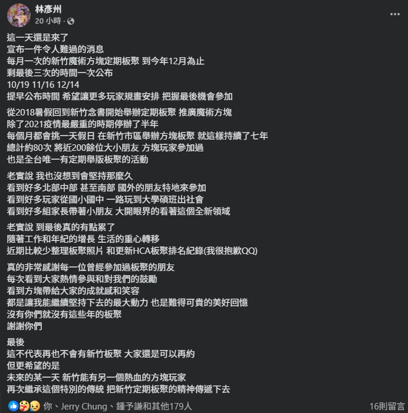
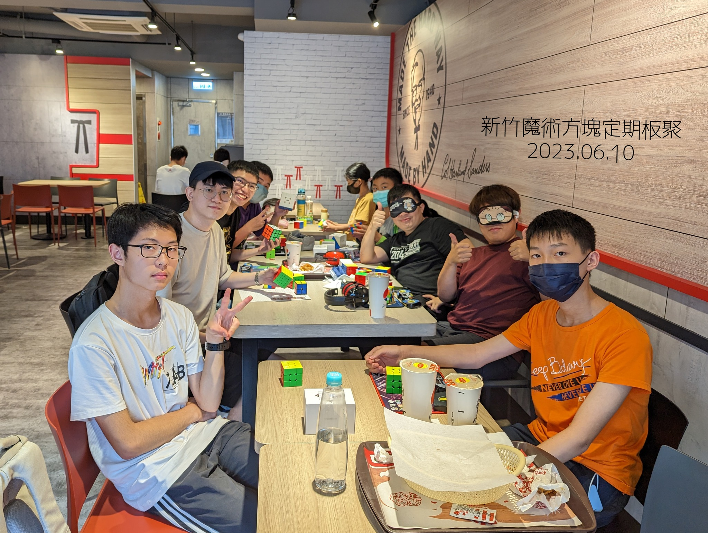

昨天看到彥州發出新竹版聚即將結束的消息，相當的不捨，但更多的情緒是懷念和感激。新竹版聚陪伴了我 2022~2023 兩年的研究所時光，認識了很多一起玩[魔術方塊](https://shuojen.site/docs/rubiks_cube/competition)的好朋友，真的很感謝也很佩服彥州對魔術方塊的熱情，只是這麼單純的對一件事的喜歡，就支持著他無私辦了七年的版聚，謝謝新竹魔術方塊版聚，眾版友們，我們未來會在 WCA 比賽場上再次相遇的！

下圖是離開新竹前的最後聚會

