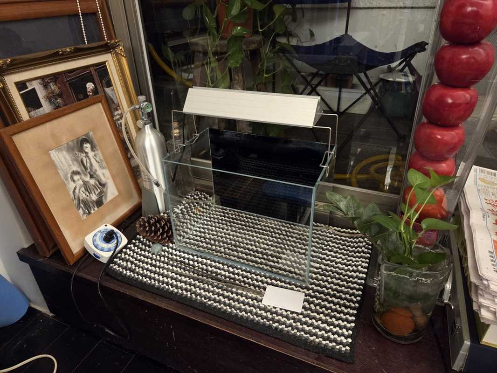

很久沒有整理和保養魚缸了，週末的時候把整個荒廢的 1.2 尺缸清洗乾淨，這次想要來打造一個鬥魚缸，跟我以往喜歡的水草缸佈置比較接近，可以看這個連結：[水族造景](https://shuojen.site/docs/aqua)。

原本打算平日下班，經過台北水族街去逛逛的，可惜連日大雨不太方便，這次的佈景想以陰性草為主，所以可以不用黑土，想試著用用看淺色的河砂搭配青龍石，效果應該不錯，預想的大概類似下方影片的佈置。

  <iframe 
    width="320" 
    height="180" 
    src="https://www.youtube.com/embed/fFa9DEObVTA?si=Bxhe8yfAQXMyPlhN"
    title="YouTube video player" 
    frameborder="0" 
    allow="accelerometer; autoplay; clipboard-write; encrypted-media; gyroscope; picture-in-picture; web-share" 
    allowfullscreen>
  </iframe>

期待開缸後成功再來分享一篇，到時候再揭曉我會養什麼花色的鬥魚吧。

