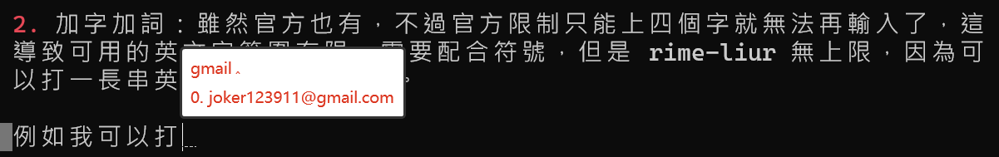
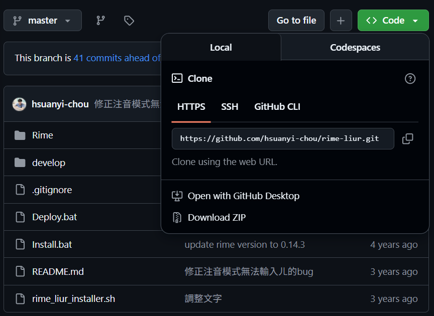

## 嘸蝦米打字練習

今天是開始練習嘸蝦米打字的第十九天，照慣例來打一篇小王子檢視一下練習成果。


目前我將公司和家中的電腦都使用嘸蝦米作為日常主力輸入法，只有在需要快速溝通時短暫切換回注音輸入法，照 Wiwi [貼文](https://wiwi.blog/blog/practice-surface-area/)中提到增加練習表面積的效果十分的顯著。

目前進步到大約 35wpm，日常使用基本上是沒問題，只是稍微慢一點點。有一個有趣的發現是，太習慣注音的電腦選字後，改用字形輸入法，有時候會需要愣住幾秒，在腦袋中選字，有時候還會熊熊想不起來想打的字某部位怎麼寫，不過也不用太擔心，想不起來也有輸入法幫忙救援，以下來說明。

## rime-liur

這裡介紹的是我使用的嘸蝦米輸入法，參考 Benben 的文章 [〈什麼時代了還在學 | 嘸蝦米輸入法〉](https://blog.errorbaker.tw/posts/benben/13-boshiamy/)[^1]內推薦的 rime-liur，由作者 hsuanyi-chou 基於 RIME 中州韻輸入法開源出來的超好用版本。

>GitHub：[hsuanyi-chou/rime-liur: 基於 RIME 輸入法設計的全功能嘸蝦米方案](https://github.com/hsuanyi-chou/rime-liur)

有幾個功能跟官方的輸入法類似：
1. 注音模式： 以「';」鍵引導可進行注音輸入（搭配 `ctrl + '` 可直接查詢蝦米編碼'）。

>最常用的功能，很多打不出來的字可以用注音輔助，再搭配查碼學習，完全不需要上網站查碼了。

2. 簡繁轉換： 於任何模式下透過 `ctrl + .`，可進行即時簡繁轉換，無須切換模式。

>我不常用，不過至少有，比注音轉換起來方便很多。

比官方更好用的幾個功能：

1. 中英混輸： 在不切換輸入法的情形下，可以空白鍵上中文字或中文符號；`Enter` 鍵上英文字或英文符號。

>這實在是太好用了，分開上字讓一樣用途的 `Enter` 變得更有價值。

2. 加字加詞：雖然官方也有，不過官方限制只能上四個字就無法再輸入了，這導致可用的英文字範圍有限，需要配合符號，但是 rime-liur 無上限，因為可以打一長串英文再 `Enter` 上字。

例如我可以打 `gmail` 來上我設定的內容，而且最棒的是不會衝突，我可以`Enter` 上「`gmail`」，空白鍵上「`joker123911@gmail.com`」。



3. 讀音反查： 以「;;」鍵引導並輸入無蝦米碼，可反查該字讀音，如「龘」=ㄉㄚˊ。

>我不常用，不過很有趣。

## 安裝流程

可以參考連接內的 Readme 說明，這裡我將介紹 Windows 系統安裝流程。

1. 首先到[ RIME 官網](https://rime.im/)下載中州韻輸入法引擎。

2. 在 hsuanyi-chou/rime-liur 的 GitHub 頁面點擊 `Download ZIP` 下載。


 
3. 解壓縮後，點擊 `Install.bat` 即安裝完成。

4. 右下方輸入法處右鍵並點擊「輸入法設定」，可選擇蝦米輸入法和各種其他想要使用的輸入法（「Ctrl+`」 可切換），還有很多種美觀樣式可以挑選。

5. 右下方輸入法處右鍵並點擊「用戶文件夾」，開啟 `liur_customWords.dict.yaml`，可自行定義加字加詞（格式注意要正確），完成後右下方輸入法處右鍵並點擊「重新部署」即可。

:::note
*2025-12-02新增 Linux安裝流程*
:::

## Linux ibus

1. 安裝IBus，開啟終端機（Terminal）並執行安裝

```commandline
sudo apt install ibus-rime librime-data-bopomofo
```

2. 在 hsuanyi-chou/rime-liur 的 GitHub 頁面點擊 `Download ZIP` 下載（同上）。

3. 到 rime 的資料夾開啟終端機並執行以下指令將下載的檔案複製過去。
```commandline
# 複製所有 yaml 檔案到 Rime 設定目錄：
# cp *.yaml ~/.config/ibus/rime/
```

4.重新部署即可使用

:::caution
Linux 版可以用注音打字功能，但是無法使用 `ctrl + '`顯示字碼，待解決。
:::

:::note
*2025-12-27*新增一個更好用的版本，由 ryanwuson 開發，功能更多，但 linux 無法使用。
:::


連結：[ryanwuson / rime-liur](https://github.com/ryanwuson/rime-liur)

[^1]:這篇文章的學習心路歷程也對我很有幫助，想學嘸蝦米的話大推。
