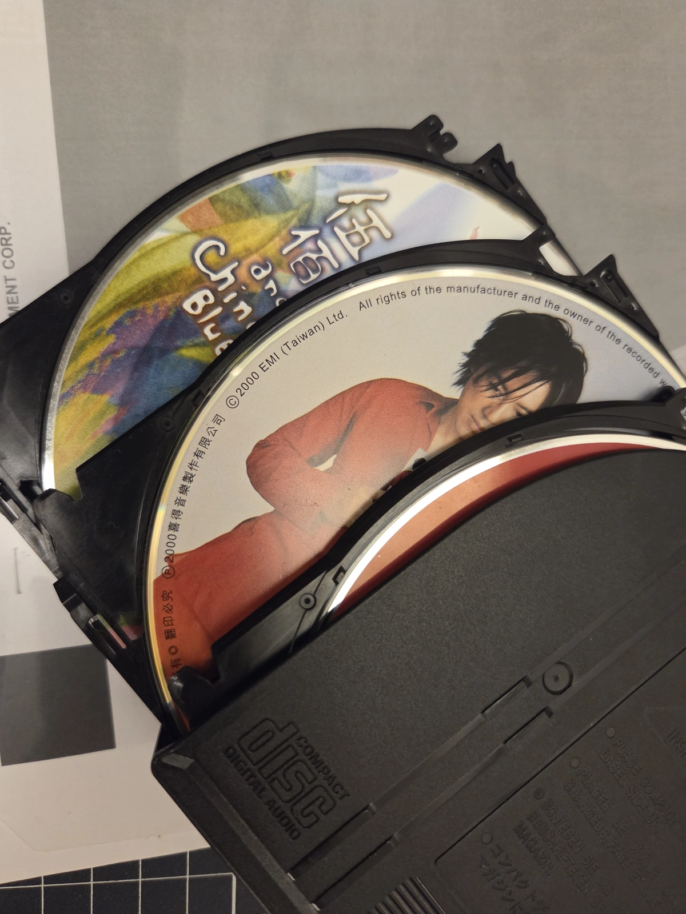
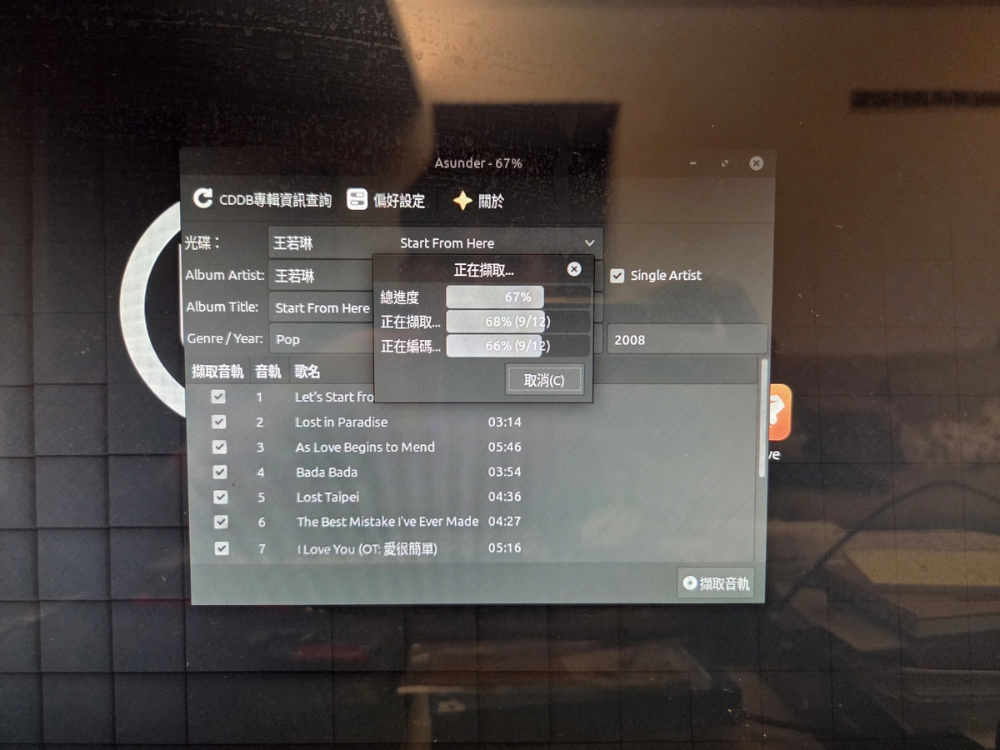
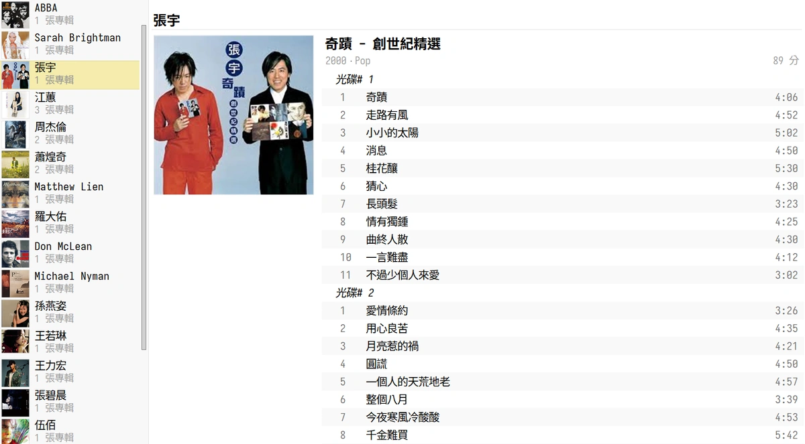

最近在整理客廳的書櫃，發現好多以前在爸爸車上聽的老 CD，有張宇的精選輯、王力宏的蓋世英雄、羅大佑、王若琳、伍佰、Sarah Brightman，每片都好有回憶，好懷念以前那種一次在車上細細地品嘗一整張專輯的感覺，雖然現在串流真的很方便，但是我還是決定把這些回憶轉成 flac 檔好好存起來聽。 

客廳的電腦是 Linux 的系統，我找到一個很易用的自由軟體 Asunder 可以輕鬆的轉檔，大部分的歌曲資訊轉檔完也都有。

全部轉檔完再用 Syncthing 同步到臥室的電腦上，缺少的資訊再用 MusicBrainz Picard 補齊，最後我是用 Windows上的 MusicBee 統整全部的資訊和專輯封面。

