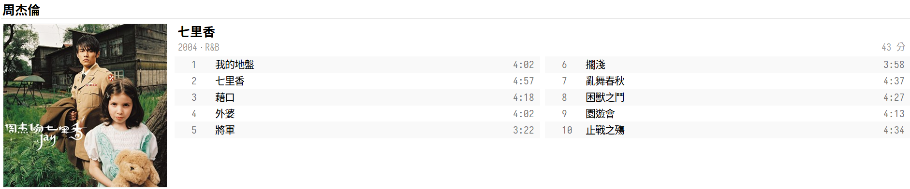
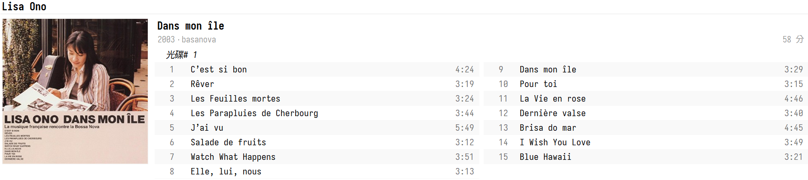
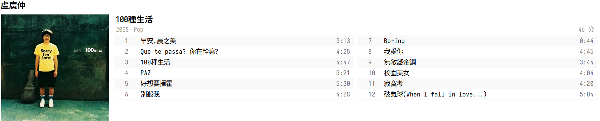
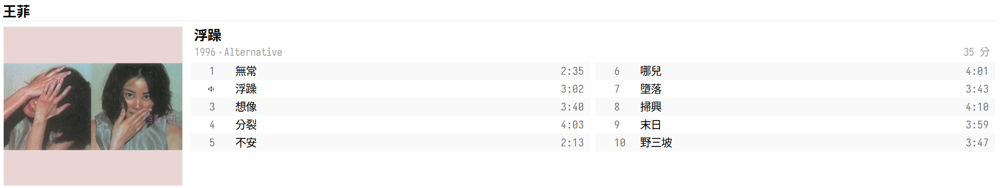
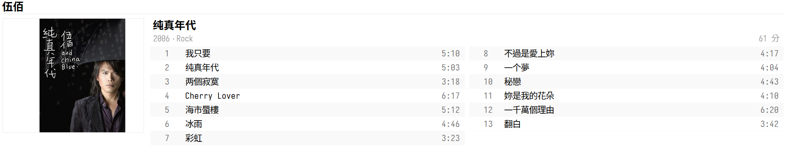

由於最近陸續在客廳的書櫃挖到老 [CD](https://shuojen.site/blog/2025/10/24/CD)，於是一直不停的轉檔，現在加一加也轉三十張了，開始我興起了用 Syncthing 同步到我的所有裝置上聽本地無損音樂的念頭，也開始研究各種音質的差異，以下為我理解到的資訊做一個記錄，有錯請不吝指正。

## 聲音檔案

主要分成類比訊號和數位訊號，類比訊號是隨時間變化的連續性訊號，例如黑膠唱片上的溝痕被唱針劃過後再經過唱頭放大到我們耳裡；數位訊號就是進入 CD 和串流時代後的產物了，它是指對聲音訊號進行切割，再由 0 和 1 記錄成數位資訊存在 CD 或電腦裡，而切割的多少和怎麼切就是今天討論的重點了。

1. 取樣頻率（Sample rate）

單位是赫茲（Hz），代表每秒的取樣次數，數值越高，代表聲波分割的越細。

* 8kHz：電話音質，足夠傳遞人聲。
* 44.1kHz：CD音質標準，用於音樂CD、MP3等。
* 96kHz：高解析度音訊（Hi-Res Audio）的標準，用於藍光光碟、專業錄音和發燒友音樂。
* 192kHz：高階影音製作和專業錄音室使用，提供極高的音頻細節和品質。

2. 取樣深度（Bit Depth）
單位是位元（bit），代表用多少位元來描述每一次取樣的聲音振幅，深度越高，能記錄的動態範圍越大，聲音細膩度和層次感越高。

* 電話、收音機音質： 8 bits。
* CD 音質：16 bits。
* Hi-Res 音質： 24 bits。

3. 位元率（Bitrate）
衡量音訊檔案的大小和串流所需的頻寬，我們可以由取樣頻率和取樣深度來計算。

`位元率 (bps) = 取樣率（Hz）x 位元深度（bits）x 聲道數（Channels）`

以 CD 音質為例：

`位元率 (bps) = 44100（Hz）x 16（bits）x 2（Channels）= 1411.2 kbps`

以 Hi-Res（24-bit/96 khz）高解析度音訊音質為例：

`位元率 (bps) = 96000（Hz）x 24（bits）x 2（Channels）= 4608 kbps`

由上述可得知，無損的 CD 音質位元率為 1411.2 kbps，比 MP3 檔最好的音質 320 kbps 再好超過 4 倍，而 Hi-Res 音質則高出超過 14 倍。

## 戰利品分享

如果可以的話，推薦大家把家裡的老 CD 都挖出來轉成無損的 WAV 或 FLAC 檔，別小看這些二、三十年前的 CD，它們都是音質超好的寶貝喔～而且重點是存成自己的無損檔案，永遠屬於你的感覺，比虛假的串流好太多了。

這次挖到我最愛的周杰倫專輯—七里香，可以收成無損檔案太開心了！

小野麗莎的 Bassa Nova 風格很適合當背景音樂。

青澀的盧廣仲，很好聽。

王菲這張都沒聽過，挖出來試試看。

伍佰這張很多經典也有冷門歌可以聽。

