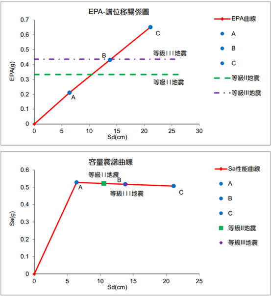
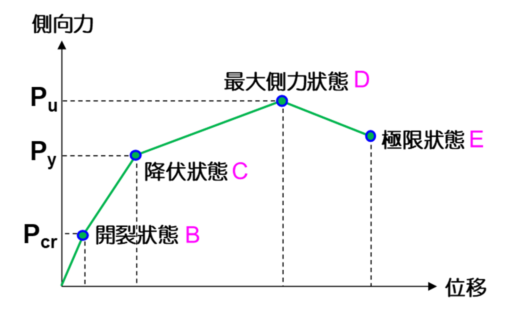
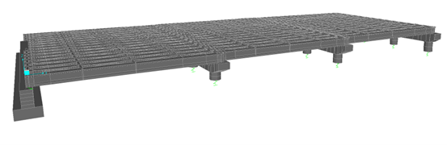

## 前言
不知道大家是否好奇，士木工程師是如何分析現有的結構物是否有足夠的耐震性能？一般在做耐震評估時，不論是橋梁、建築物，工程師都會採用「側推分析」（pushover）來判斷耐震性能。

假設某橋梁工址位於新竹縣竹北市，屬第二類地盤（普通地盤）。
```
SII,S = NA x FaS x SII = 0.832

SIII,S = NA x FaS x SIII = 1.09 

故等級 II 地震之 EPA = 0.4 x SII,S = 0.333g

等級 III 地震之 EPA = 0.4 x SIII,S = 0.436g
```
耐震性能曲線即可求得各等級地震對應之 Sd 值，視為本單元之**耐震需求**。

我們再將橋軸向側推曲線（P-Δ）及容量震譜（Sa-Sd）透過 SERCB （側推分析程式）可求得整體橋梁橋軸向容量曲線上各位移所對應之 EPA 值，建立耐震性能曲線。依規範求取各地震等級所對應之性能點。 設計規範為 84 年版以前及重要性橋梁，依規範規定，性能狀態 B 點之非彈性譜位移與非彈性譜位移容量之比值取 2/3 可得 B 點，及 A～ C各性能點對應之譜位移 Sd 值即為本單元之**耐震容量**。



再觀察耐震容量是否大於耐震需求（B 點大於等級 II 地震、C 點大於等級 III 地震）即可判斷耐震性能是否足夠。

# 什麼是側推分析
透過在結構物上施加一適當的水平側向力，依比例逐漸增加水平側向力並記錄構材發展的各種行為：如開裂、降伏、塑性變形和結構失敗等，並在一連串的迭代過程中，依照觀察到的各個結構構材在不同受力階段的結構行為，修正構材有效勁度矩陣特性與不平衡力，再利用片段線性（piecewise linear）的特質，採逐步（step by step）階段分析的方式，直到塑性鉸發展至崩塌機制或到達極限塑性變形為止。



---
以下為側推操作細節。
# 建模
依橋梁做說明，橋梁型式可大致分類為幾種排列組合。
1.	上構：PCI、RCT、PCBOX、鋼桁架、鋼箱梁
2.	下構：單柱式、框架式、壁式橋墩
3.	基礎：直接基礎、椿基礎、井式基礎



此範例為PCI框架式井式基礎橋梁。

## 建模步驟
1.	每個單元個別建立模型，根據峻工圖之柱高、跨徑、邊界條件、上構型式建立模型，土壤彈簧以鑽探資料計算求得，直接基礎、椿基礎須建基礎板再加上土壤彈簧。

3. 加模型載重
   1. DL（端隔梁、中隔梁重量），可直接加集中力
   2. DL2（鋪面、護欄等），加線載重於主梁上
   3. NL（鄰跨力），加鄰跨一半重量於支承上

3. 地震力分配 

   1. 依縱、橫向分 Group（縱向為 Hinge、Ridge 橋墩，橫向全部橋墩及所有上構）
   2. 施加 1 單位力於振動單元
   3. 讀取振動單元節點質量
   4. 將節點質量 x 9.81 x 0.1（0.1g）施加於各節點
   5. 靜力分析後讀取振動單元之位移，檢視規範週期是否與 SAP2000 週期相近（誤差建議在 3% 以內）

# SERCB 側推整體性能評估
## 前處理
建立.sect、.met斷面檔。
### .met
RC組成率 84 年版及以後選取「Mander」，以前選取「Kawashima」，每墩剪力筋頂底不同時，需建立兩種斷面。
### .sect
建立斷面箍筋號數及間距、主筋數量（照座標建立），每墩主筋頂底不同時，需建立兩種斷面
Export出 .mdb與.s2k檔。

## 前處理（2）
### .bcf
1. 填入Section、FrameName（頂與底）、鋼筋號數、鋼筋強度、斷面位置、帽梁深度，地震力推縱向選 Ux，橫向選 Uy（根據 Sap 中地震力名稱）。

2. 程式會讀取模型內 AllDL 與地震力取橋墩 Moment3-3 之彎矩，並計算塑鉸，若無塑鉸的位置 Height 可填 1 ，即不會塞入塑鉸，橋台亦不塞入塑鉸。

3. 單柱縱橫向及框架式之縱向一律取全柱高（含帽梁），框架式橫向柱高由程式計算（不含帽梁深度）。

4. 生成有塑鉸的.s2k檔。
## 後處理

1. 匯入.s2k 檔，檢查塑鉸後，調整 Load Case 中 PX 參數，調整觀測點。

* 側推後將 Rseultant Base Shear vs Monitored Displacement 匯出.bfd 檔 。

* ATC-40 Capacity Spectrum 匯出.csc檔（Structural Behavior Type 改為 A）。

* Export mdb 檔，Nonlinear Static Results 選擇 Step-by-Step，用以柱塑鉸發展狀態 .phs 檔用。

2. 建立.pap 檔，輸入工址條件、地盤種類，Kapa 選取 1，用途係數選取 1.2。
3. 分析得 .EPA .PFC .PHS 檔。

# 橫向側推
步驟與縱向一致，注意以下更改
1.	模型橋墩 Properties 長寬須互換，並將 Local Axis 旋轉 90 度。
2.	.met .sect 柱主筋、箍筋等更改。 
3.	.bcf 改 Uy 方向重出。
4.	Load Case 中 PY 改為 U2 方向。
5.	橫向保留柱頂、底塑鉸。

# 構件檢核
* 防落長度：檢核伸縮縫位置，PCI 每跨都檢核。
* 支承：含橋台。
* 帽梁：看模型橫向 250 0年 LoadCase-PY，Moment 3-3 臨界斷面處彎矩與剪力。

# 橋墩補強
橋梁位在嚴重及中度鹽害地區，需增加保護層厚度，故RC包覆補強厚度由 25cm 改為 30cm。

## 情況一
鋼鈑韌性補強厚度小於 16mm，耐評補強後報告已鋼鈑韌性補強為主。

### 補強方案一
以鋼板韌性補強為主（SECRB 圓形斷面選擇 SJRCIRL、方形斷面選擇 SJRRECT）厚度 10mm~16mm 均可。

### 補強方案二

RC 包覆韌性補強（SECRB 圓形斷面選擇 CJRCIRL、方形斷面選擇 CJRRECT），厚度 30cm，主筋鋼筋支數依需求決定，淨間距需小於 1.5d，號數以 D25 為主。

## 情況二
鋼鈑韌性補強厚度大於 16mm，耐評補強後報告已 RC 包覆強度補強為主。
### 補強方案一

鋼板韌性補強（SECRB 圓形斷面選擇 SJRCIRL、方形斷面選擇 SJRRECT）測試到看要多少，厚度不拘（純計算費用使用）。
### 補強方案二

RC包覆強度補強（SECRB 圓形斷面選擇 CJSCIRL、方形斷面選擇 CJSRECT），厚度 25cm，如下圖範例，主筋鋼筋支數依需求決定，淨間距需小於 1.5d，號數以 D32 或 D36 為主。

# 除錯
* .bcf 出錯，查看桿件名稱、桿件編號或柱高太短，塑鉸計算有問題。
* EPA 分析出錯，先檢查 .pap，通常原因為 .bfd 與 .csc 步數問題，先將過多的步數砍掉，多嘗試幾次。
* 模型不收斂：能推至達耐震需求則無所謂，若無，檢查模型桿件建立是否有誤，調整分析步、觀測點，PCI 可嘗試將橋板接縫連接起來。


