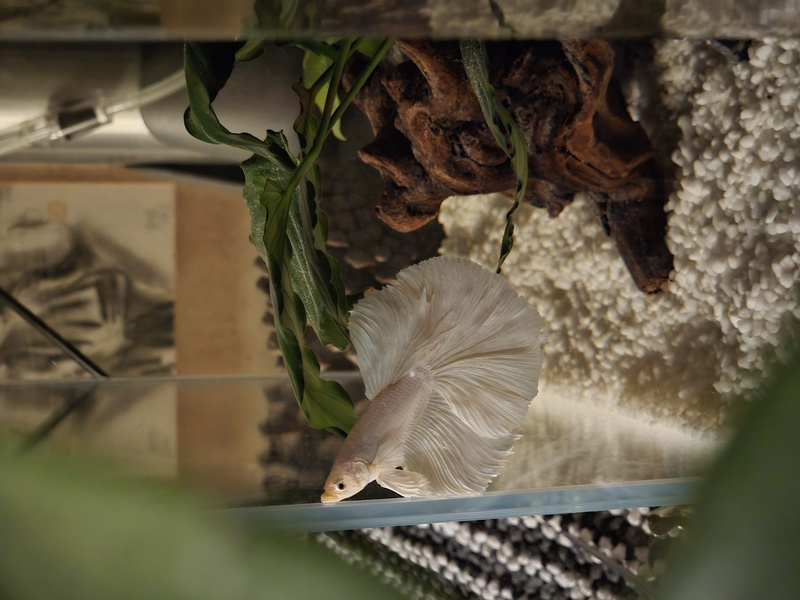

## 新朋友入缸啦！
這次是從 YouTube 頻道 [「鬥魚棧」](https://www.youtube.com/@njc4678r) 的直播競標購入的。其實在大學時期，我和室友就常常一起追直播、參加競標。看著一尾尾漂亮的鬥魚出場、大家互相加價，那種又緊張又期待的感覺真的很有趣，而且還能順便欣賞到許多美麗的鬥魚。

## 競標鬥魚

只要有耐心慢慢跟，運氣好的話就能以不錯的價格拿到魚況極佳的鬥魚。這次我運氣超好，才跟半小時就在我的預算內競標到我喜歡的魚，最後以 250 元 的價格，加上 110 元運費，成功標下這隻我一見鍾情的***白金半月鬥魚***。牠入缸後狀態很好，身形、開片、顏色都相當亮眼，非常滿意。

:::note
2025.10.21 [保養魚缸](/blog/2025/10/21/fishtank)。

2025.11.06 [設置魚缸](/blog/2025/11/06/fishtank)。

2025.11.18 鬥魚入缸。 
:::

