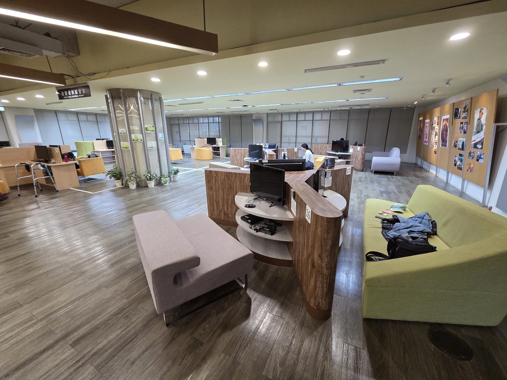
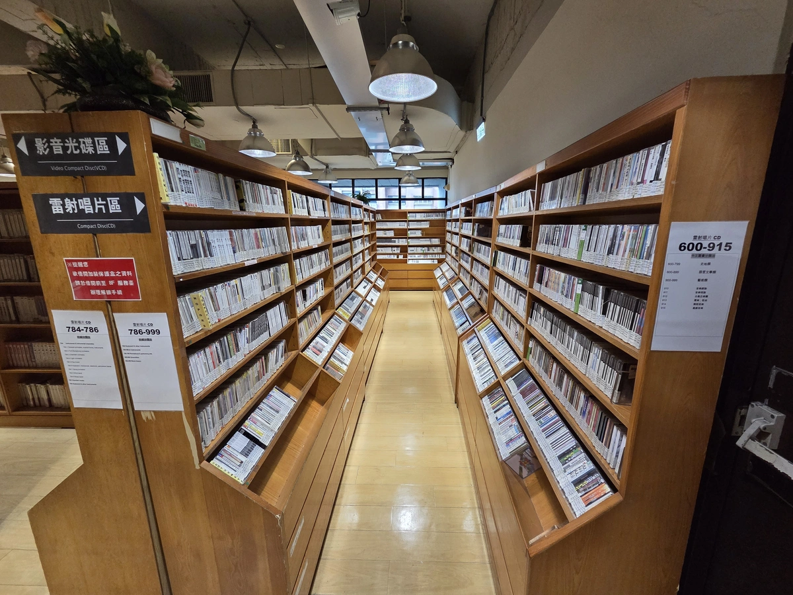
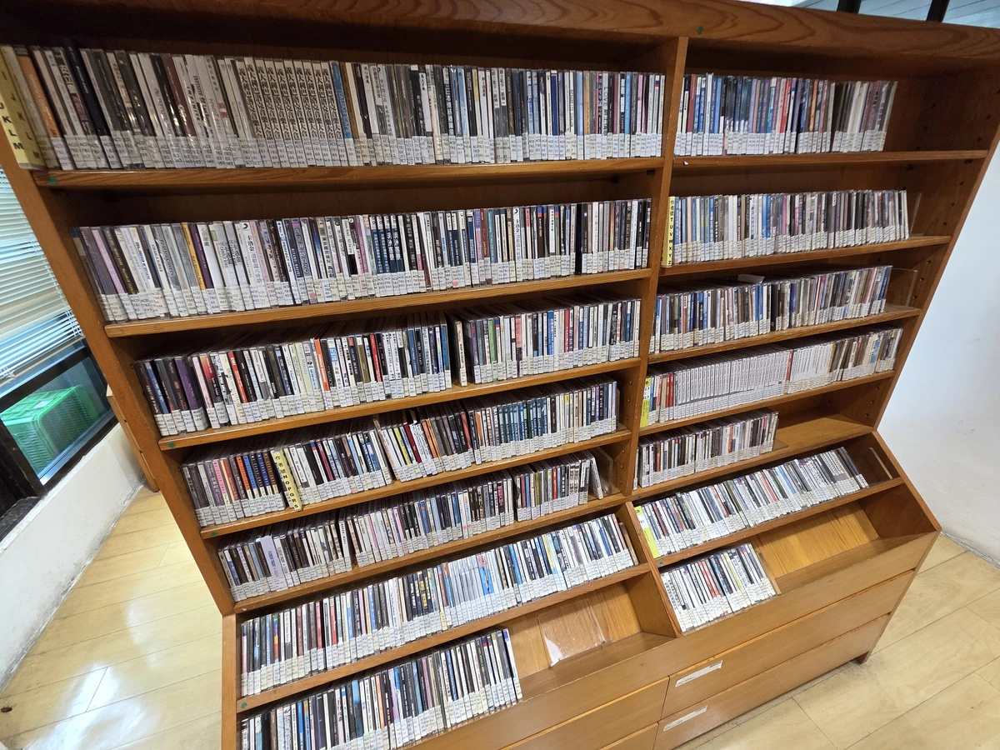
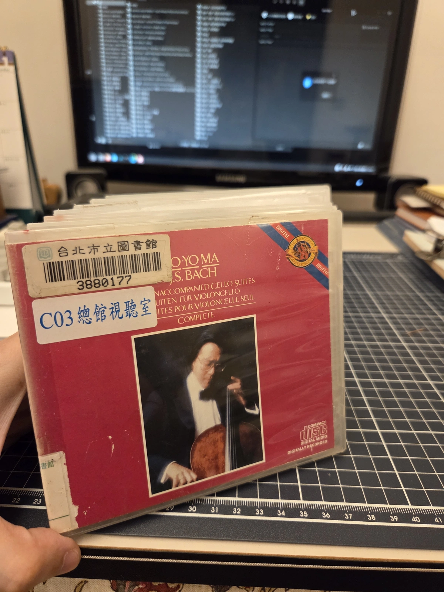

今天假日一時興起跑到圖書館逛逛，發現這總圖的八樓視聽空間規劃的很舒適耶，還有很多很多 DVD、CD 可以慢慢看挑選，雖然都有點年代了。

如果週末不知道要去哪裡，或者厭倦了滑手機的空虛感，真的很推薦大家來總圖的視聽樓層走走，享受這些很不錯的免費資源。 不需要帶著很強的目的性，就是單純地去感受那個空間、去翻翻那些實體光碟，真的可以度過一個意外充實的午後。

借了這張馬友友的專輯，巴哈太好聽了。

