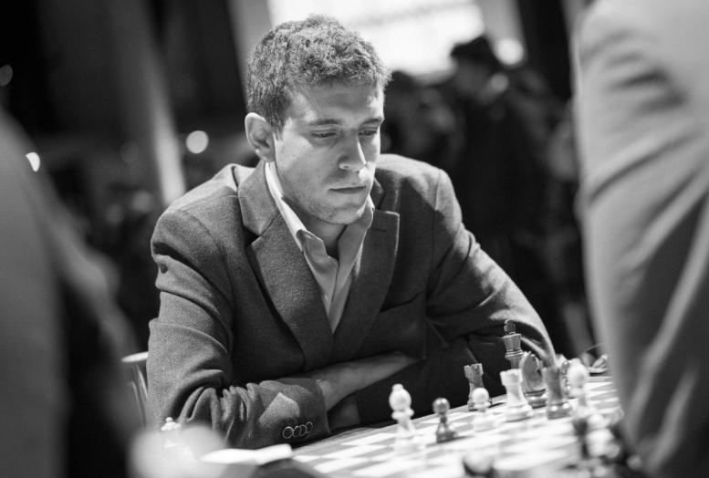

---
> [FIDE：Daniel Naroditsky (1995–2025)](https://www.fide.com/daniel-naroditsky-1995-2025/)

今天得知我最愛的西洋棋手 Daniel Naroditsky 在十月離世的消息，他是世界最頂尖的特級大師之一，也是著名的美國西洋棋 Youtuber。才華洋溢的他僅僅得年二十九歲，到現在我的心情還是無法平復。

在去年 Danya 捲入 Kramnik 無端指控作弊的爭議後，心理狀態似乎就不太好，也變得比較少更新西洋棋影片，我看到 Danya 最後一部片的標題寫著 `You Thought I Was Gone!?`，心情就非常的難過，我們都知道他再也不會回來這裡，為觀眾講解一盤盤精彩的對局了。

我只想說，在綱路上對他人無理的指控跟惡意，是真的會嚴重的影響到一個人的，媒體上無從得知 Danya 是如何離世的，我相信他走的很安詳，離開到一個更美好的世界。

我的開局系統有一半以上都是 Danya 的影子，不論是對付王兵開局的 Four knight scotch、對付法蘭西防禦的 Advance Variation、對付西西里防禦的 Smith-morra，都是 Danya 細心拆解指導的，謝謝 Danya 帶給世界的一切，讓遠在一萬公里外的一個陌生臺灣人，這麼深深的被你影響著。

在日本漫畫棋靈王裡，佐為在與近藤光的一場日常對弈後，就這樣突然的消失了，進藤光從此不再碰觸圍棋，意志消沈了好長一段時間，直到進藤光跟伊角接續下了之前一直沒下完的一盤棋，他才發現佐為沒有不見，佐為一直都存在著，活在他的棋裡。

我想，Danya 也是一樣，會在所有喜愛你的觀眾的棋中，一直一直，永遠長存下去吧。

