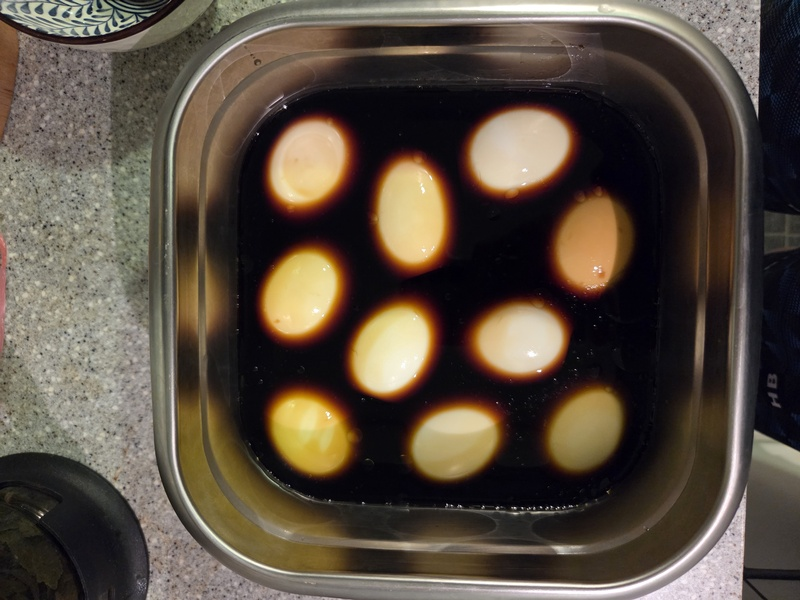
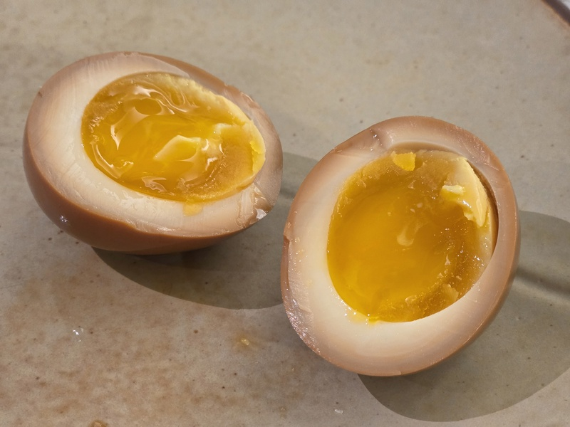

## 平日早餐
平常早上都吃 7-11 的一顆動福滷蛋 + 無糖豆槳，可是動福滷蛋要 18 元好貴（雖然真的很好吃），於是在家自製溏心蛋，算起來只要一半的價錢，難度也滿低的，推薦。

## 溏心蛋食譜
1. 水煮滾下冷藏雞蛋
2. 計時 6 分鐘取出泡冰水後剝殼
3. 調好醬汁，水：醬油：糖 = 1：1：0.3，其餘花椒粉、七味粉照個人喜好加
4. 冷藏一晚即可食用

:::note
*2025-12-18更新*

Tips：
1. 在雞蛋底部先戳個小洞再下比較不會破
2. 怕鹹的人，醬油比例可以再略少一點
3. 冷藏 12~24 小時就可以吃了，醃太久會太鹹
:::

