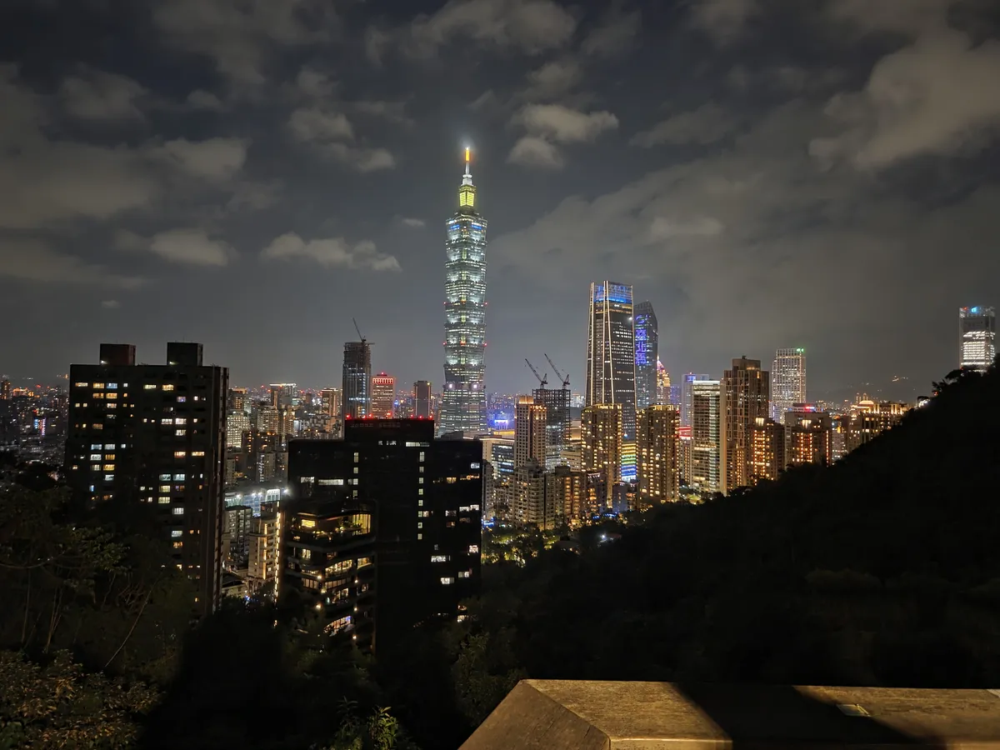
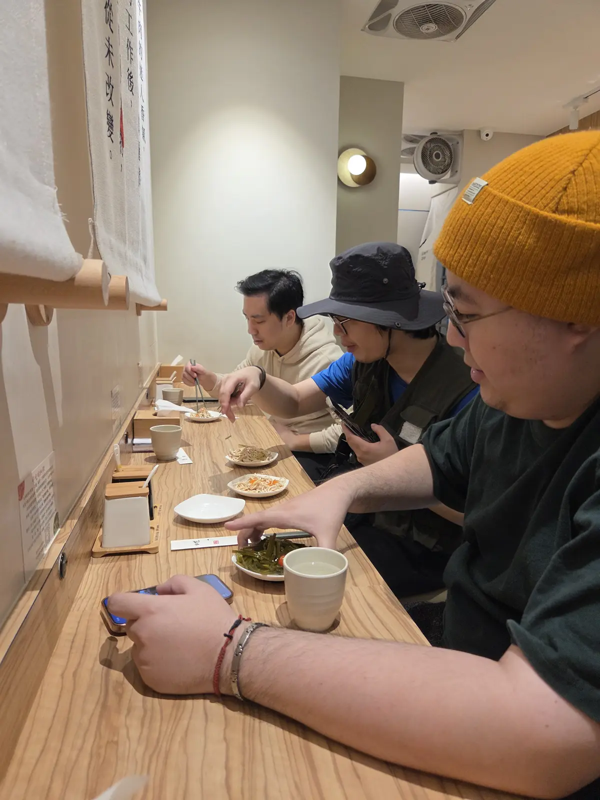
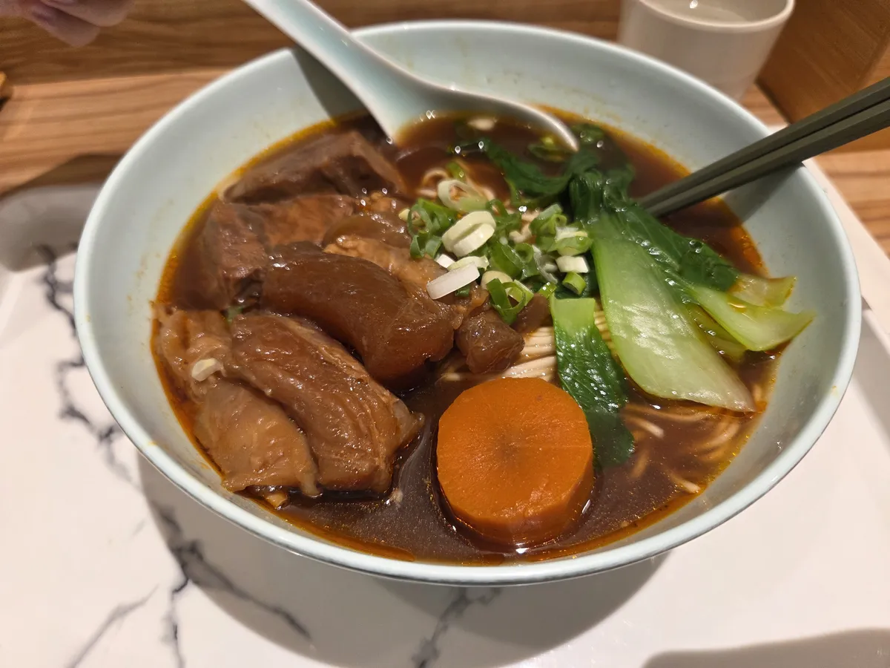
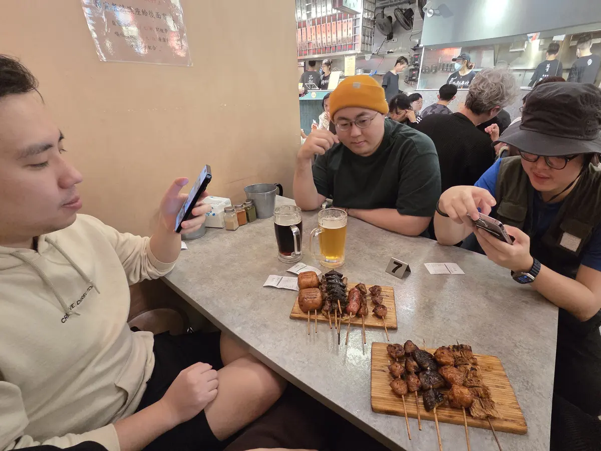
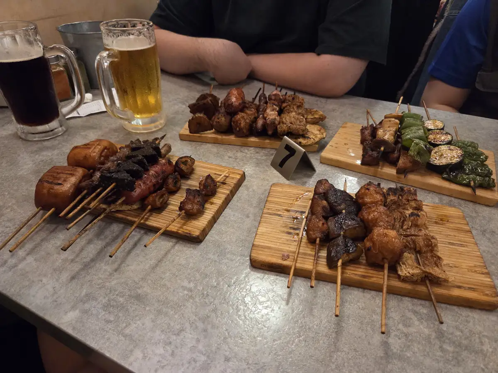

美國朋友聖誕節回台灣了，久沒約的豪情四兄弟，直接下班隨便約約就出動集合，認識十四年的直男們就是這麼隨意，行程都是碰頭了再即興發揮。

下班直接衝象山公園，第一站先上六巨岩暖暖身。

下山後突然下大雨，騎回家換裝，再到延吉街的[地一牛肉麵](https://maps.app.goo.gl/5p18rJ3YW1sKoAv8A)集合，好吃大推。

再去平價又有氣氛的[品都串燒](https://maps.app.goo.gl/1BXktNKmYimw7T6r5)來杯生啤酒，秘訣是晚上 11 點來，躲避大批人潮。

