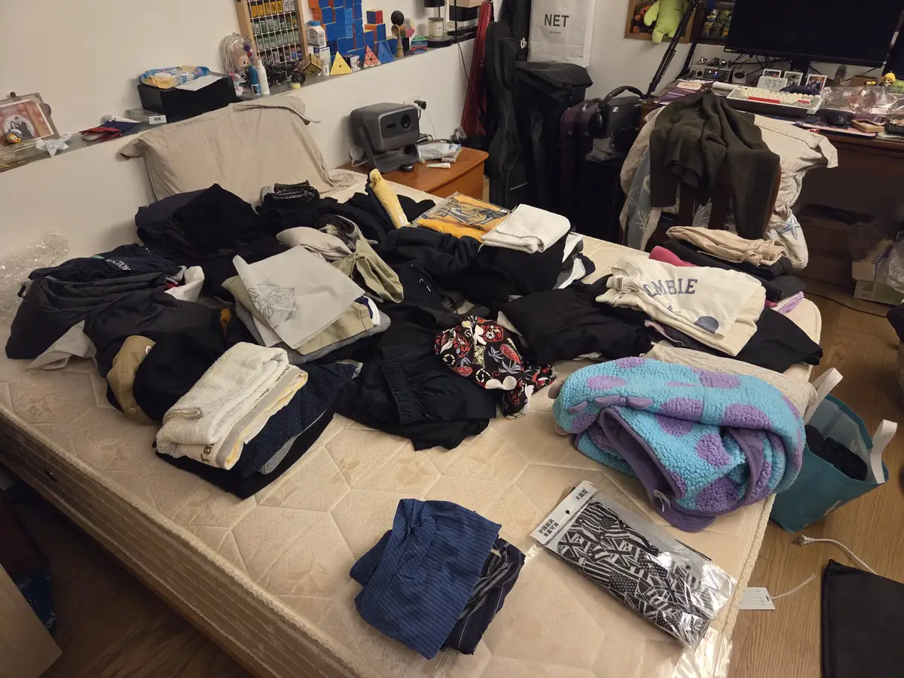
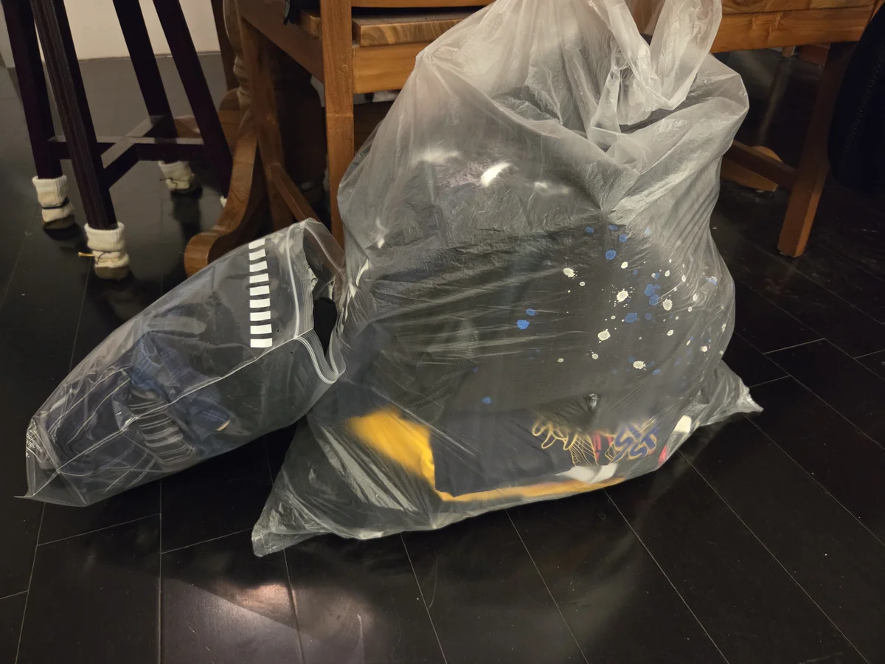
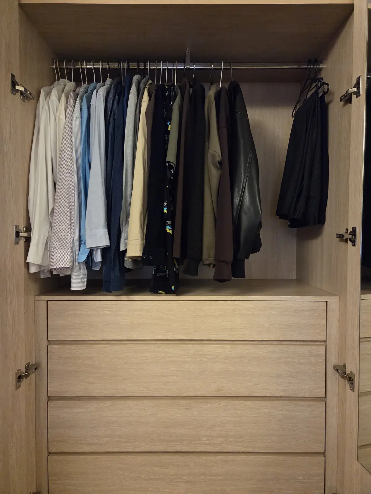
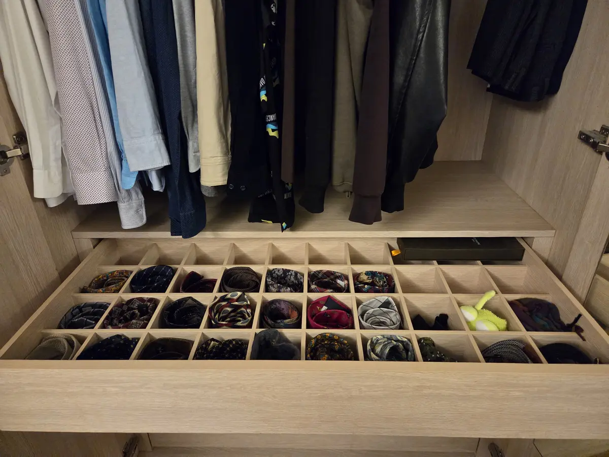
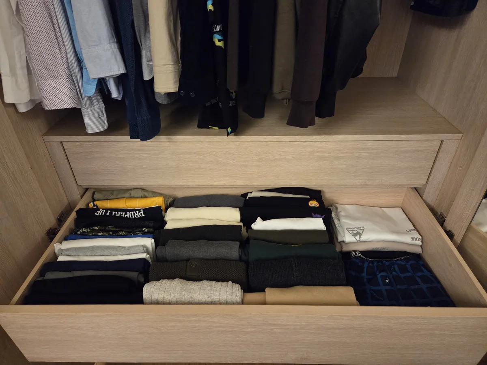
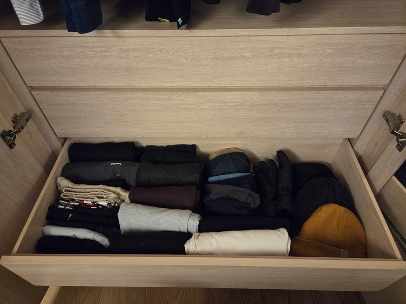

放假在家來整理一下衣櫃，把許久不穿或早就不合身的老衣服處理掉，上網搜尋一下找到這個很不錯的頻道，專門教學斷捨離和整理的相關知識。

末羊子的[就這10招！萬年不會敗的衣櫃整理法🥹！](https://www.youtube.com/watch?v=1BnuUOP89WQ)

## 整理步驟

1. **斷捨離**：把所有衣服取出平放，開始丟，分以下幾種。
   * 喜歡且常穿：留，稍後放在好拿取的位置。
   * 喜歡但不常穿：適量保留，最需要精選的部份，很佔空間。
   * 不喜歡但常穿：可以保留，但未來就先汰換這些。
   * 不喜歡且不常穿：我認為超過一年沒穿的，很高機率就不會再穿了，下定決心丟掉吧。

光一小部份床就擺不下了（床單順便拿去洗）

 

最後整理了三大袋，捐舊衣回收箱，給有需要的人。

2. **分類**：我把衣服分成上半身跟下半身，再各分春夏與秋冬，分別放上下層，同類型的整理在一起，襯衫類及西裝褲等等不適合摺的就掛起來，大件衣物全部掛另一個衣櫃。

 

3. **收納**：使用日本專業整理師[近藤麻里惠](https://zh.wikipedia.org/zh-tw/%E8%BF%91%E8%97%A4%E9%BA%BB%E7%90%86%E6%83%A0)的直立式收納法，實測後真的多了很多空間，而且所有衣服一目瞭然，美觀又好拿取。

 
 
 

 
 
4. **整理結束之後**：從源頭做起，建立好習慣。
   1. 了解自己，購買真正適合自己的衣物，買衣服前三思而後行，不只浪費錢，也佔了空間，對未來的自己也是負擔。
   2. 決定購買一件新單品前，想出與現有衣櫃中的組成多種不同的穿搭，避免買到「孤兒單品」。
   3. 衣服有一定數量後，維持一進一出原則，買一件就出掉一件，才不會容易讓衣櫃爆滿。
 

 

 

 

 

 

