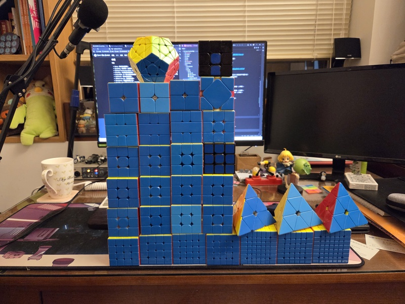

今天在寫部落格的[`/use`](https://shuojen.site/use)頁面，想說來整理一下我所有的方塊好了，原本以為過了兩年沒有認真玩，我會不記得自己買過什麼方塊，但沒想到一拿到手上，我竟然完全可以靠手感就知道它是什麼方塊，真是太神奇了！整理後才發現我有四顆魔域出品的 RS3M[^1]，只是都不同版本（當時有新版本就想試），這個我就真的分不出來了。

可愛的方塊們合照：



## 連解

<div className="video-container">
  <iframe 
    width="320" 
    height="180" 
    src="https://www.youtube.com/embed/eE4td_TQw_A?si=hKSRFg2RPG45UhxC"
    title="YouTube video player" 
    frameborder="0" 
    allow="accelerometer; autoplay; clipboard-write; encrypted-media; gyroscope; picture-in-picture; web-share" 
    allowfullscreen>
  </iframe>
</div>

即然都把方塊拿出來點名了，就來玩個連解吧，不過三階以外的就不玩了，會太累。

總共 13 顆三階 + 一顆被我改造過的 Valk 只要解底十字，從左手邊照順序排到右下，打亂公式[^2]如下：
```
1. U' R D2 F' R' L' D' R2 U' D2 L2 D F2 D' R2 B2 L2 B' U2 
2. B R2 F' B2 R2 U2 L2 F2 R2 D B2 U' F2 U2 F' D2 L2 R' B F2 R2 
3. U' D2 B R2 D2 B2 R2 U2 B' R2 F L2 F2 R' F2 L' D B U R' U 
4. F' D2 B2 R B2 R U2 L2 U2 R' B2 U2 R D' B2 R' B L D B2 F 
5. R B' R2 D U L2 D F2 D B2 U2 L D F R' F U' F U' 
6. U B U' D2 F2 R2 F' U' R' B2 D2 F' R2 F U2 L2 U2 L2 B' R2 B 
7. L' D2 F' U2 B2 R2 F' D2 F' U2 F' U2 L F2 D L F' U' B' R' 
8. D' B2 R' F D' F' L2 U' B D' F2 R2 L2 F2 R2 U' D2 R2 U2 
9. U R2 U' F2 R2 B2 R2 D2 L2 R2 D L' B R' U2 L2 B L' D2 U' B' 
10. R2 D2 B' L2 U2 R2 D2 B F2 U2 L2 R' F2 L2 U' B' F2 D2 U2 R' 
11.  B' U' F2 L' D2 B2 U2 L2 B R2 U R2 D R2 B2 U B2 U2 B2 R2 
12. F2 U2 D B L' F2 B' D' R2 F B D2 F L2 B2 D2 R2 F D2 L2 
13. R D2 R L' D' B' R L2 U R D2 L2 U2 L' F2 U2 R D2 L' B2 
14. L2 D R2 B2 D2 B2 D L2 B2 R2 F2 R' D U2 B U L2 D2 L F U'
```

## 結果

最後成績 *3:29.35*，算 13 顆方塊平均每顆 16.1 秒，看來沒練習真的有點退步了，轉到第四顆還有一個邊塊爆開真的笑死，久久沒玩，感覺回來不少。

[^1]:這是當年 CP 值最高的方塊，便宜又好轉。
[^2]:請參考魔術方塊[轉動代號](https://1hrbld.tw/cube-notation/)。


