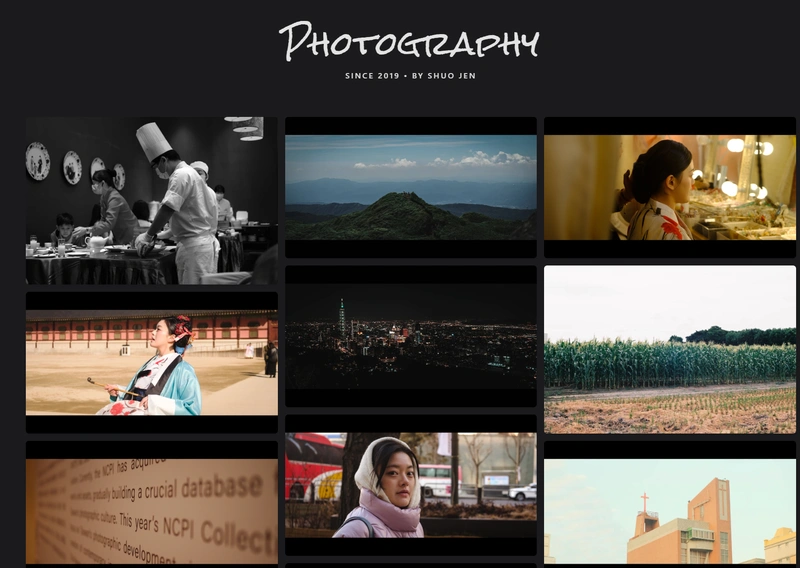

趁著放假在家，忍不住想動手折騰一下自己的部落格，為我的[攝影頁面](/photography)做一個大裝潢，沒想到進入[心流](https://zh.wikipedia.org/zh-tw/%E5%BF%83%E6%B5%81%E7%90%86%E8%AB%96)[^1]狀態，抬頭時竟然快天亮了。

原本這個攝影頁面只是照搬一般貼文的 Markdown 格式，將攝影照片獨立區塊而已，現在我將它重新設計成**隨機排列的「瀑布流」佈局**。這樣的視覺呈現讓頁面更有作品集的質感，每一次重新整理都有不同的驚喜，隨著照片累積的越來越多，更能讓我透過這些相片回憶過去美好的片段。

原本的攝影貼文也沒消失，點擊照片後，依然可以導向原本依照拍攝日期的隨手紀錄，在攝影列表中也能快速查看，這是我近期最喜歡的一個部落格改動。歡迎大家來我的攝影頁面逛逛，感受一下我熬夜打磨出來的新樣貌！

喜歡的話也歡迎訂閱攝影 [RSS](/blog/2025/09/16/rss/)！雖然更新頻率比較低。
```
https://shuojen.site/photoblog/rss.xml
```



[^1]:全神貫注、忘我投入的心理狀態。


