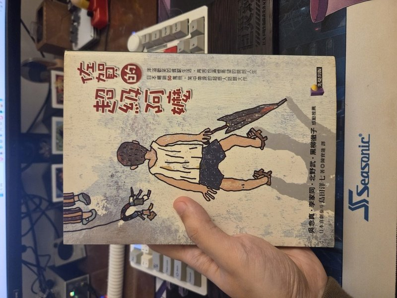

最近聽 Podcast [^1]聽到日本人黑木太太分享台日的文化差異，我覺得很有意思。

>台灣人是比較熱情一些些，假如說，去約會好了，不知道對方是喝美式或是拿鐵，不知道哪一派的？我們這時候日本人的想法是： 不想造成他拒絕的麻煩，所以不買好了，這是日本人
；那台灣人是：算了先買～先買，等一下再多點一個，台灣人是 Yes 的文化，跟我們是 No 的文化，所以不同的溫柔嘛。

真的是很傳神的一個例子，文化差異的不同，體現出兩種相反的作法，卻是同樣的心意，這也讓我想到小時候很喜歡讀[《佐賀的超級阿嬤》](https://zh.wikipedia.org/zh-tw/%E4%BD%90%E8%B3%80%E7%9A%84%E8%B6%85%E7%B4%9A%E9%98%BF%E5%AC%A4)，裡頭溫暖的小故事。

主角家裡窮，帶便當總是只有白飯和酸梅，學校運動會當天，他怕丟臉，躲回了教室偷偷吃。這時老師走了進來，說：「昭廣，我今天肚子痛，聽說你有帶梅子便當，它對肚子痛比較好，可以跟你換一下嗎？」昭廣就這樣驚喜的吃起了滿滿炸蝦丶香腸丶炒蛋的豪華便當。隔年運動會，昭廣升上四年級，新的班導師是個女生，運動會當天，她也說自己肚子痛，想要換便當。昭廣一直到畢業後跟阿嬤提起，才知道老師們的用意。

真正的體貼是讓人察覺不到的，我想，這就是日本人的溫柔吧。

[^1]:[日本女生聯誼心機招數 ft.黑木太太 | EP99](https://www.youtube.com/watch?v=737xv0hG-NQ)