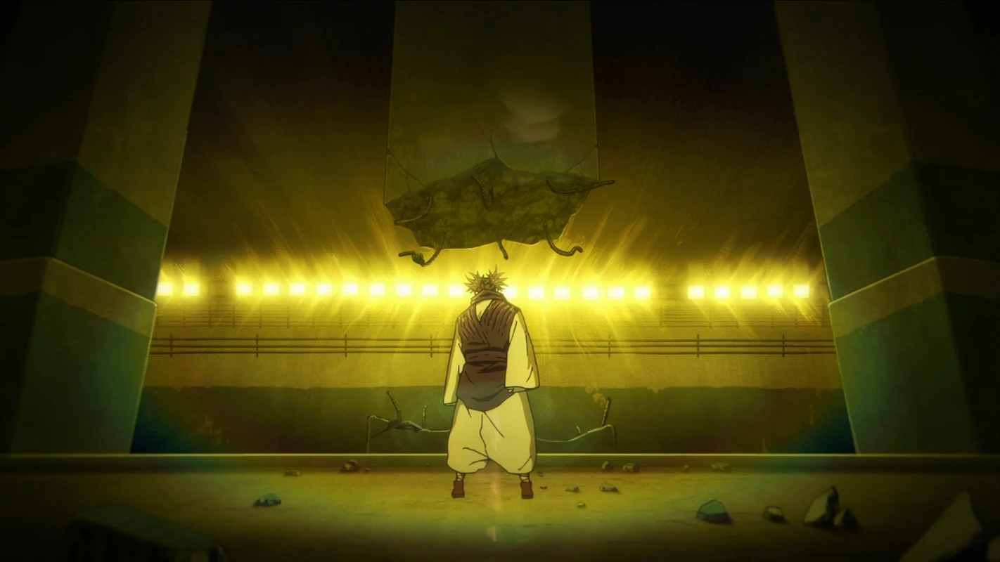

▲《咒術迴戰》第 49 話〈再一次〉

小知識：澀谷事變發生在日本，與臺灣同為地震帶。若根據臺灣現行《建築物混凝土結構設計規範》第十章的內容，依畫面上這個比例，柱尺寸約是 1.5 x 1.5 公尺，最少鋼筋量理應配置 225 平方公分的主筋，約為 45 根的 #8 鋼筋，畫面上只有 6 根，而且沒有配置繫筋和箍筋等剪力鋼筋，這個斷裂位置為塑鉸區，依耐震規範，箍筋應會配置 135 度彎鉤並縮小間距，使其核心混凝土緊密圍束。

>10.6 鋼筋限制
> 
>10.6.1 最少及最大縱向鋼筋
>
>10.6.1.1 對於非預力柱及平均 fpe < 16 kgf/cm2 [1.6 MPa] 之預力柱，縱向鋼筋面積應至少為0.01Ag，但不應超過 0.08Ag。

在《咒術迴戰》的設定中，許多破壞是由「咒力」造成的，或許動畫中這根柱子可以依靠「咒力抗震法」，但以現實的土木工程來看，這根柱子的配筋連【鋼筋混凝土學】助教那關都過不了。

