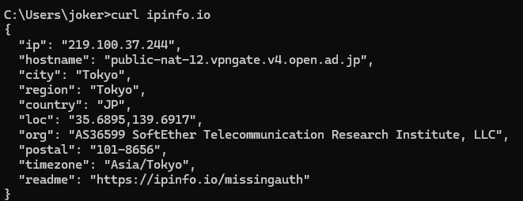
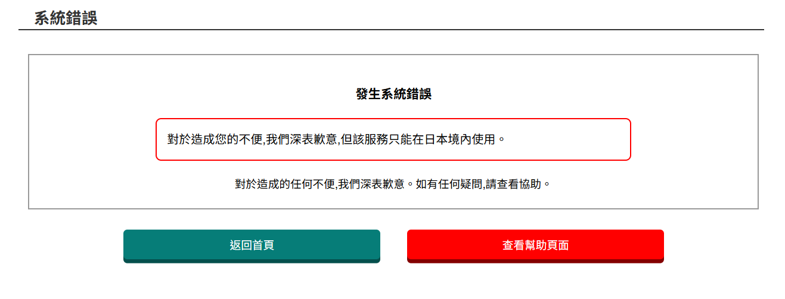
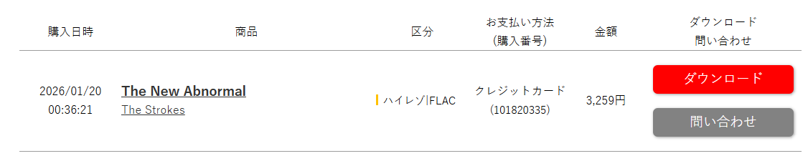

今天發現了一個非常好用並且免費開源的 VPN，是由日本筑波大學以學術研究為目的而營運的 [VPN 服務](https://www.vpngate.net/ja/)。 下載操作非常的簡單，基本上照著網站的步驟，五分鐘左右就可以順利完成了。

連上後，打開終端機輸入以下指令來查看是否成功：

```
curl ipinfo.io
```



可以看到已經連上日本了！

## mora.jp

原本如果想在日本的網站 [mora.jp](https://mora.jp/) 購買音樂，會如下圖所示。

>對於造成您的不便，我們深表歉意，但該服務只能在日本境內使用。



用完 VPN 後，輸入信用卡後就順利購買完成啦。

（The Strokes -The New Abnormal 這張超好聽，大推薦。）


:::note
重新整理還是不行的話，應該是瀏覽器的快取內容殘留著之前的定位資訊，嘗試使用無痕模式再試試就沒問題了。
:::


