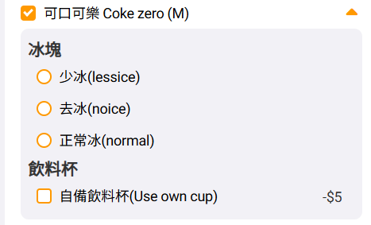

昨天晚上去買速食，在網站上點餐看到有自備飲料杯的選項，還可以折五元，當時心裡還默默為店家的環保意識大力讚賞一番。

結果到了店裡取餐的時候，我看著店員熟練地將裝好可樂的塑膠杯蓋打開，從紙杯裡將飲料倒進我的環保杯中。

>這樣不就浪費一個杯子了嗎？

我拿著那杯「二手可樂」，帶著滿腔的疑惑離開了。這只是把垃圾留在了店裡，而我帶走了 5 元的罪惡感，我只能安慰自己：那個杯子一定會留給下一個客人用的……會吧？（心虛）

