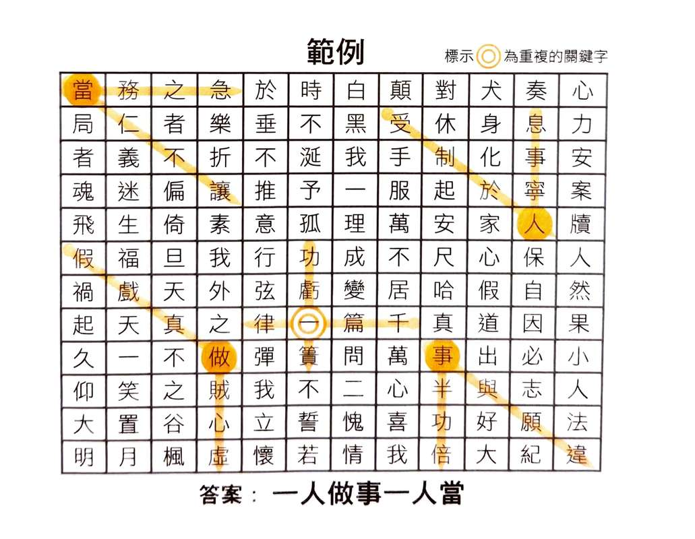

我最近忙了好一陣子做出來的文字遊戲「成語迷宮」試玩版發佈啦！

連接點我：[成語迷宮 Beta 試玩版](https://shuojen.com/game)

## 遊戲範例
　

這個遊戲的玩法很簡單：

>1.表格中藏有數個**四字成語**，排列順序可能是由上而下，由左而右、由右而左，或是呈對角線，請先找出表格裡的成語。
>
>2.每兩個成語的交叉處可得到一個**關鍵字**，關鍵字有可能會重複。
>
>3.找到的關鍵字可組成一個**俚語**，即為最後答案。

## 回憶

大約在 2006 年，我哥在自由時報上的週末專欄連載一個文字遊戲，名叫「成語迷宮」。這是他在國高中時期設計的，大約連載了三年，後來在 2009 年集結成冊，出了一本[實體書](https://www.eslite.com/product/1001241171914561)[^1]，在當年那個手機不普及的年代，受到還滿多家裡有訂報紙的讀者喜歡。

我有印象在我國小的時候，當時報社需要庫存，要一次交好幾份稿，我哥找我幫他一起做，兩個人就窩在電腦前，上教育部的[網站](https://dict.idioms.moe.edu.tw/search.jsp)[^2]查成語，用 Word 表格慢慢刻，再一個字一個字填上去，一次完成好幾份稿（原來我不到十歲就當下包接案了，~~但我似乎沒拿到報酬~~）。

中間這十幾年，偶爾家人們聊天的時候，會提到要不要把這個遊戲出成 App 等等的想法，但大家總是隨口提提，沒有什麼實際作為，我哥也許有問過幾個朋友，但似乎也沒什麼下文。這個遊戲誔生至今已經二十年了，在我心中一直是個跟我哥的美好回憶，於是我利用週末和下班的閒暇時間，做了這個網頁版，想說今年回高雄過年時，再給他一個驚喜，就當做一個新年禮物吧。

## Vibe coding

還好這個年代有 AI，不然我真的不知道，一個非本科的外行人，需要耗費多少時間才能完成這個遊戲程式。做的過程中我真的學習到很多，很有趣，尤其是想盡辦法要模擬一個亂玩的「奧客」玩家，抓出各種 bug，還有在那麼多關卡（120關）的情況下，要怎麼再想一個邏輯生出一個測試的程式，之後再寫一篇文章來分享。

:::note
由於尚未經過原作者的同意，所以我沒有將全部的關卡都放上來，只有五關讓大家幫忙試玩看看，覺得有趣的話，一定要留言或寫信跟我說，我想我哥也會很開心的。
:::

[^1]: 這本書在各大平台都顯示絕版了，不過想要的話可以聯絡我喔。

[^2]: 我記得應該是類似的網站，但 UI 跟我的印象差滿多的。