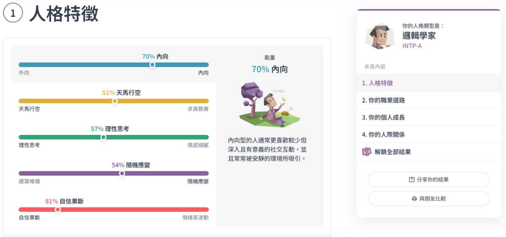

自從寫完[〈只有我這樣嗎？〉](/blog/2026/01/29/really)，又看了 Wiwi 的[〈INFJ〉](https://wiwi.blog/blog/infj)一文，我就在想一件事，為什麼我這個喜歡準時的人，居然一直以來測 MBTI 都是鐵打的 INTP？於是我又測了一次。

## 觀察

我發現自己測驗的結果都是偏光譜中間，在某些事的想法是比較 P 的，某些比較 T，所以測出來的還是偏 P 人。

### P 人的一面

* 我喜歡偏向隨遇而安，讓一天無拘無束地度過，不做任何日程安排（漫無目地放鬆最高）。

* 我完全不熱衷借助日程規劃和任務清單等組織整理工具（只用最簡單的手機行事曆記日期）。

* 對於保持持續一致的工作或學習時間表，我常常力不從心（真的很無聊）。

* 我不喜歡每天都有一份待辦事項的清單（工作的話會）。

* 我滿心期待能擁有一份工作，在這份工作中，你可以獨來獨往，大部分時間都沉浸在屬於自己的工作節奏裏（現在工作差不多是這樣）。

* 你按部就班地完成事情，不遺漏任何步驟（感覺要看什麼事，不一定都那麼按部就班）。

---
### T 人的一面

* 我喜歡提前謀劃，有條不紊地對任務進行優先級劃分與規劃，總能游刃有餘地在截止日期前早早完成任務（工作的方面都比較 T 人）。

* 你更喜歡先處理好各種家務瑣事，然後再放鬆（玩的比較心安）。

* 你時常事到臨頭才匆忙行動，臨陣磨槍地去處理事情（不太會，我喜歡準時）。

* 一旦你的計劃被意外打斷，你便會馬不停蹄地采取行動，渴望以最快的速度讓一切回歸有條不紊的正軌（秉持著快速解決問題的想法）。    

## 對 MBTI 的想法

其實一開始我對 MBTI 的態度和星座相同，是相當嗤之以鼻的，覺得就是個偽科學，但漸漸的年紀增長，對任何事情都不會再抱持二分法的否定，對 MBTI 的想法變成是一個快速認知自己性格傾向的小參考，就算不準確、缺乏客觀評價也無妨（~~總比星座更虛無飄渺的根據好吧~~），就是個可以快速和陌生人打開話題的大眾心理測驗，根本沒必要抱持絕對的真理，認為這世界上的東西對就是對，錯就是錯，有些時候，工具是在滿足人類的社交需求，或是對自我的認知和滿足感，我認為人在各個選項中抉擇的時候，都會或多或少下意識的選擇自己比較想成為的那個樣子，當你真的認為你是那樣的性格，自然而然就會「Fake it till you make it」（假裝成功直到成真）。

當我的想法這樣轉變的時候，我也從 T 人越來越往 F 人靠近了吧。
