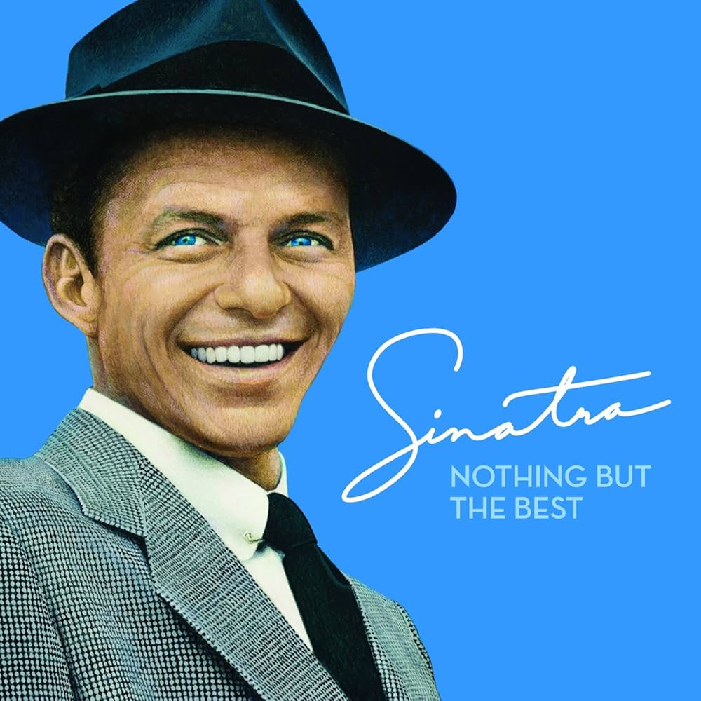
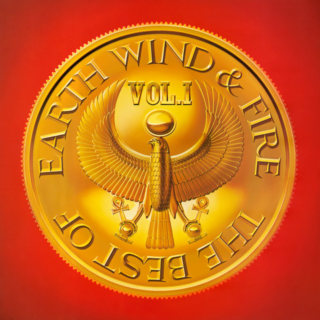
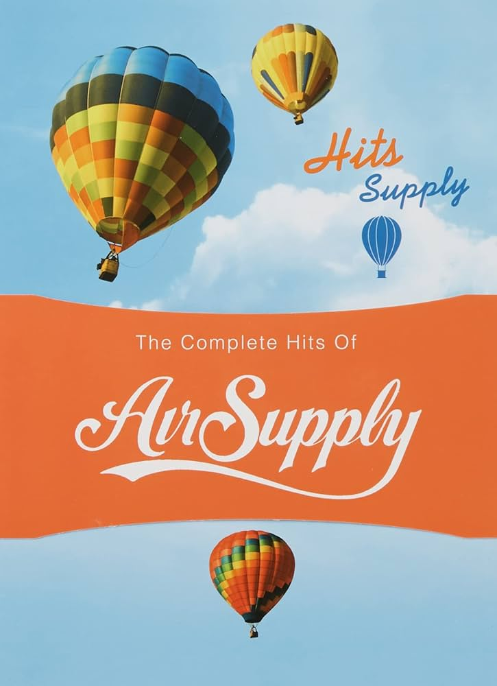

從開始迷上用 [CD 轉檔](/blog/2025/10/24/CD)聽離線音樂後，現在我的音樂庫已經有 121 張專輯了！已經漸漸的越來越少開串流音樂平台了，今天來推薦幾張我愛的復古精選輯吧。

## 60s

Frank Sinatra 的《Nothing But The Best》，各首經典都有，收錄大家耳熟能詳的
〈Fly Me To The Moon〉丶〈That's life〉丶〈My Way〉，搖擺放鬆，舒服好聽。

## 70s

Earth, Wind & Fire 的《The Best Of Earth, Wind & Fire Vol.1》，動感的派對風格，
濃烈的迪斯可色彩，好喜歡〈September〉歡快的旋律。

## 80s

Air Supply 的《Hits Supply : The Complete Hits》，老派的浪漫軟搖滾，在爸爸車上從小聽到大，我最喜歡的是〈Goodbye〉丶〈Two Less Lonely People In The World〉丶〈Every Woman In The World〉。

還有好多像是 ABBA丶The Carpenters丶Bee Gees 都好有童年記憶，看來年紀漸長後就只愛聽回憶滿滿的復古老歌，這件事是真的。