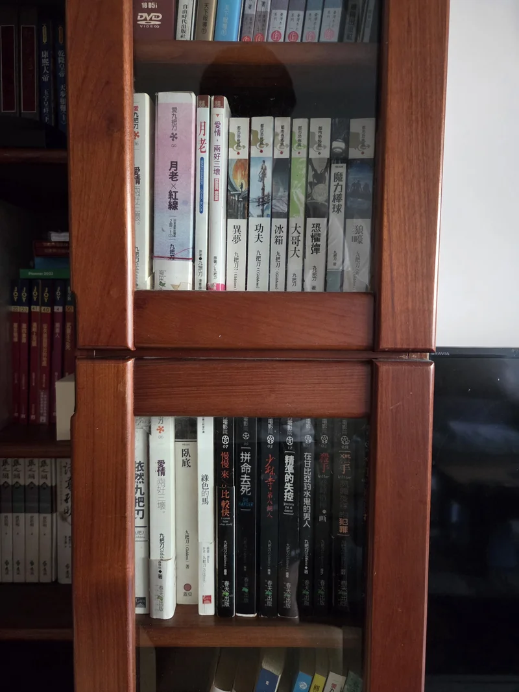

今天聽台灣通勤第一品牌的節目：[EP525 免費柯景騰 ft. 九把刀](https://www.youtube.com/watch?v=KyhCo_CeUHM)，應該是我最近聽到最好笑又有趣的一個訪談。

九把刀提到面試研究所的時候，跟教授說，他想做的研究是清大夜市野狗的身份認同，研究方法是跟蹤野狗真的超級好笑（結果沒錄取）。後來九把刀到了東海大學，找了超難畢業的人類學專家趙彥寧老師，說論文題目要研究自己，後來真的順利畢業，還將自己的論文出書，書名是依然九把刀，我發現家裡書櫃竟然有，是小時候我唯一沒看過的一本（現在來拜讀一下）。

## 對九把刀的回憶
小學時候，我哥就很愛九把刀的小說，家裡有數十本，幾乎每一本他都有買，我也跟著一起看，不管是奇幻故事，愛情小說，或是寫親人和自己的狗，每一本我都覺得很有意思也很好看，在國高中之前那個沒有智慧型手機的時代，九把刀的小說對我來說就是最好的娛樂。

這幾年來，我一度對他相當反感，看著他在小說裡寫盡深情，現實卻爆出感情爭議，總覺得有種違和感；成為了成功的商業電影導演後，新出的寥寥幾本小說不再好看。我能理解拍電影總是有商業考量，但身為老讀者，對於魔改後的電影也提不起什麼興趣，漸漸地，對他的作品也就徹底無感了。

## 新想法

聽完 Podcast 節目後，我久違的搜尋了[九把刀官方網站](https://giddens.idv.tw/)，介面跟十幾年前已經截然不同了，很有回憶的感覺，逛了一下，發現還有[新文章](https://giddens.idv.tw/category/news/)，抒發近期流浪狗紀錄片又被翻出來批評的心情。

>我一直都很清楚，當年議題研討會上也言明了，現在的日本之所以可以做到零撲殺，收容所也超級乾淨超級人道沒什麼狗，就是因為當年日本政府先捕殺了超級大量的流浪狗，才有機會來一場深植人心的多年教育
>
>我不會，也不可能，站出來大吼讓我們把流浪狗都殺光吧！殺光再教育好不好！
>
>十二夜最大筆捐款的對象，是絕育流浪狗的機構
>
>我知道絕育緩不濟急，但緩不濟急又怎樣，這是我的心
>
>我怎麼樣也說不出口的話，用另一種方式努力。我說不出口，但我批評過政府捕捉與安樂死流浪狗了嗎？我說不出口，那種話說出來我會哭，所以我自己用我不會哭的方式努力，就要被丟石頭嗎？

聽了他的訪談，再看了他的文字後，我意識到九把刀始終是個很「真」的人，他很忠於自我，做自己覺得對的事情，也難怪一直以來爭議不斷。關於感情私事，不是當事人本來就無從置喙；關於小說與電影，身為讀者我很高興他現在的成就，只是他的創作已經不再是我喜歡的作品，僅此而已。

即使我不認同他所有的作為，但我相信他對於流浪狗的出發點是很善良的，讀著他的網站，好像有種回到小時候，讀著這個人在文字背後拼命表達自己的那種感覺，我發現自己還是很喜歡九把刀這個人，喜歡他的真誠和搞怪的想法，他確實是一個非常有趣的人。

