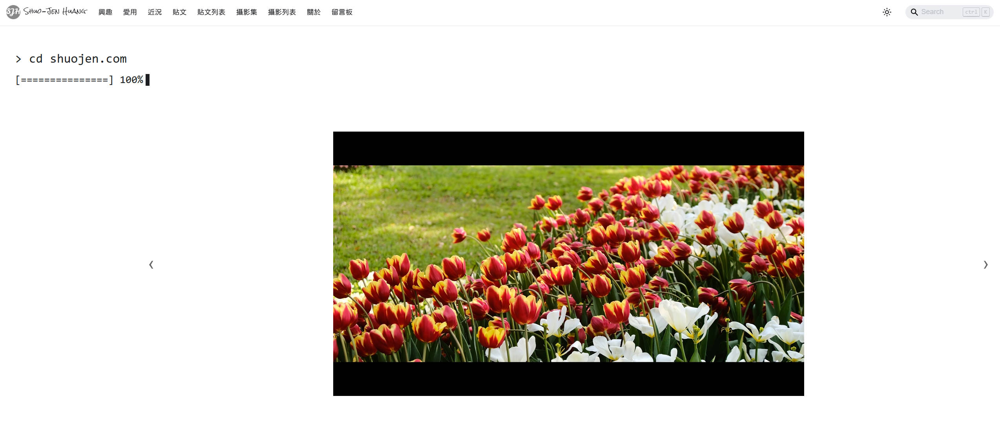

今天看到[ Jaron ](https://www.jaron.tw/blog/multiple-domain/)受[ jackie liu ](https://www.jackieliuart.com/)的啟發，將自己的[ jaronwong.com ](https://jaronwong.com/)做一個極簡風格的首頁，瞬間就燒到我了！只要大家都這樣不斷分享[推坑](https://wiwi.blog/blog/blogblog-party-jan-2026/)，啟發的循環就是這麼的容易。

歡迎大家現在來新的[ shuojen.com ](/)首頁，我是覺得新風格滿有趣的，有點像[攝影集](/photography)這個分頁，隨機抽取列表裡的照片，最喜歡的是終端機的指令的顯示方式。

