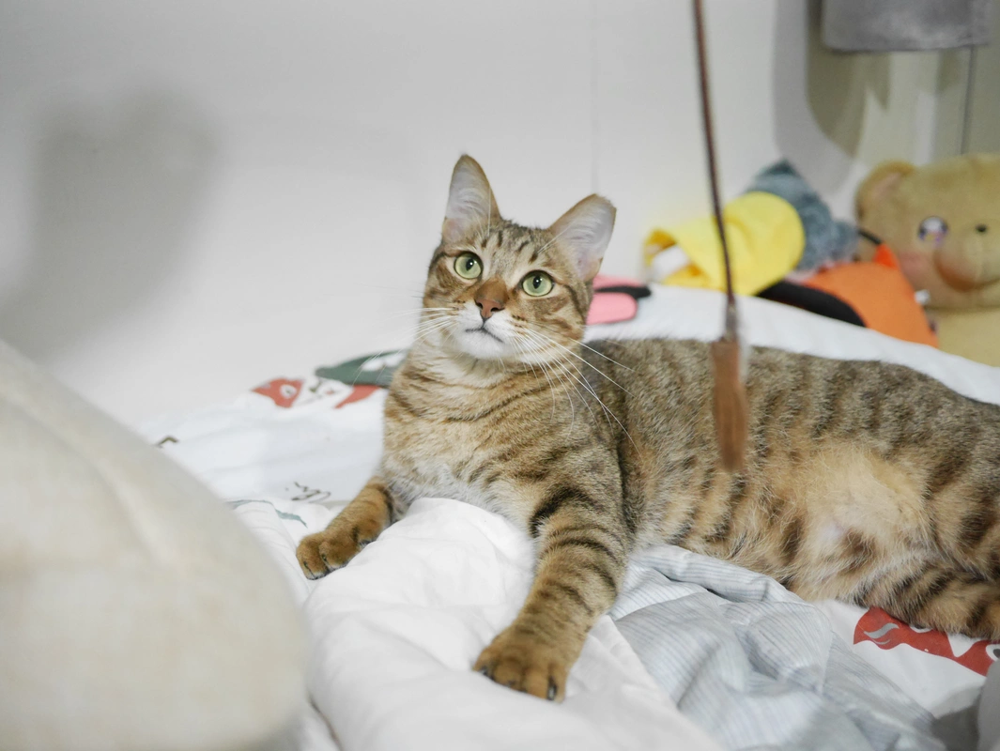

:::info
這是我的「[BlogBlog 同樂會](https://blogblog.club/party/) - 2026 年 3 月」的投稿文章。本月主題是「理想的日常」，由 [Alex Hsu](https://alexhsu.com/perfect-days) 主持。如果你有自己的部落格，歡迎一起來參加！
:::

看到這個主題不禁喚起我的記憶，我曾經在七年前的某一天，覺得當天過的很舒服愜意，於是在手機記事本寫下過這個主題，結果翻翻手機就找到了。

---

***2019-02-13***

起床

餵魚

煮杯咖啡配上豆漿

聽披頭四彈一下吉他

出門與喜歡的人享受午餐

到圖書館讀一小時書做些筆記

借一本好書回家閱讀

到健身房運動一小時

回家休息

彈一下鋼琴

上一下網玩一下電腦

---

***2026-02-26***

起床

摸摸小貓

泡一杯高蛋白配上豆漿

聽邊 CD 轉檔的音樂邊寫一篇部落格

與蝦波出門享受午餐

到健身房運動一小時

回家休息

彈一下鋼琴和吉他

下下西洋棋

與蝦波吃個晚餐散散步

睡前找一部電影跟蝦波一起看

---

我發現即使過了七年，我理想的日常一直都差不多，每個悠閒的假日，都是我最放鬆的好日常，陪伴愛的人，看看電影丶玩玩貓，不用什麼複雜的東西，幸福就是這麼簡單。

