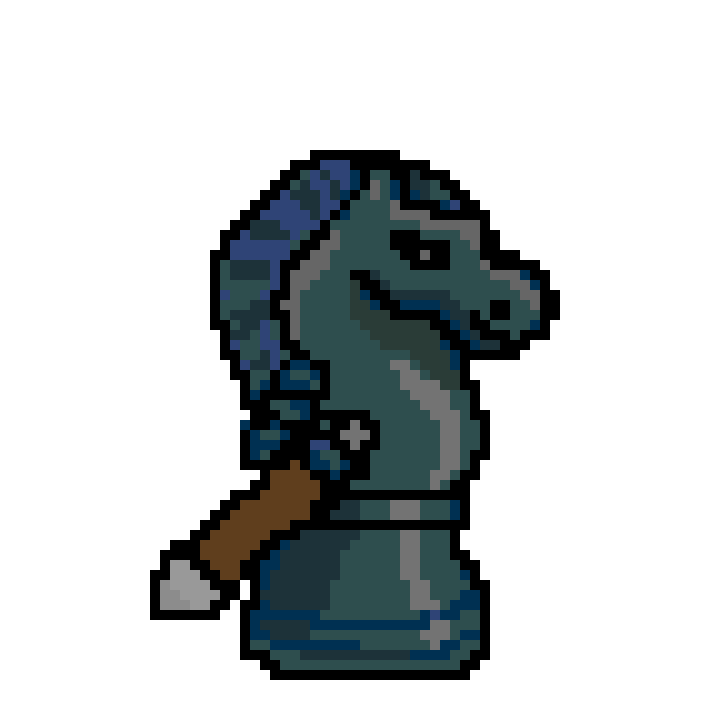

感謝 Shuyu 大大的在第一期的同樂會推坑：[〈試著用 Krita 畫像素。進階的三明治，一起來畫吧！〉](https://shuyulin1127.com/how-i-draw-a-pixel-art-sandwich-in-krita/)讓我萌生了想要試試看像素畫的念頭。

後來又看到 Shuyu 大大出的這篇：[〈在 Krita 繪製像素 GIF 動畫全紀錄〉](https://shuyulin1127.com/how-i-render-a-pixel-art-gif-in-krita/)，就想製作一個西洋棋騎士拔劍的兩格動畫（不知道只有兩格能不能成立）應該很酷，由於一開始用 16x16 的小畫布，像素實在太少了，反而更難畫，所以我後來選擇 72x72 的像素，好好玩阿。

動畫的部份太難了，還在研究中，今天先完成到這裡吧！