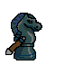

繼上一篇[ Pixel 像素畫](/blog/2026/02/28/pixel)的動畫版：，把上次的拔劍動畫完成了！

幾個踩坑的地方分享給跟我一樣的新手：

1. 上次畫的檔案輸出 png 檔之後就忘了存原始檔了，所以我用 Krita 裡的 `濾鏡` -> `色彩轉換` -> `色彩轉為 Alpha（透明度）` 把背景重新去背後再開一個新檔，貼過去就可以了。

2. 做動畫也是卡了一陣子，因為我是先把兩張圖畫好，結果插入動畫的時候，圖層大亂，顯示的也很奇怪，有點小崩潰。後來想到解法是開一個新檔，照著 Shuyu 大大：[在 Krita 繪製像素 GIF 動畫全紀錄](https://shuyulin1127.com/how-i-render-a-pixel-art-gif-in-krita/)的步驟，整個新的檔案就會很順，不太會有問題了，再直接把畫好的圖用貼的這樣比較快，貼的時候可能整軌上都有那一幀的圖，再把前面刪除即可。

3. 最後可以決定一下每幀的長度，像我想要持劍久一點，就把第二幀的時間做長一點。

:::note 
現在在首頁就看的到這個小像素動畫啦～小圖也滿可愛的。

:::

