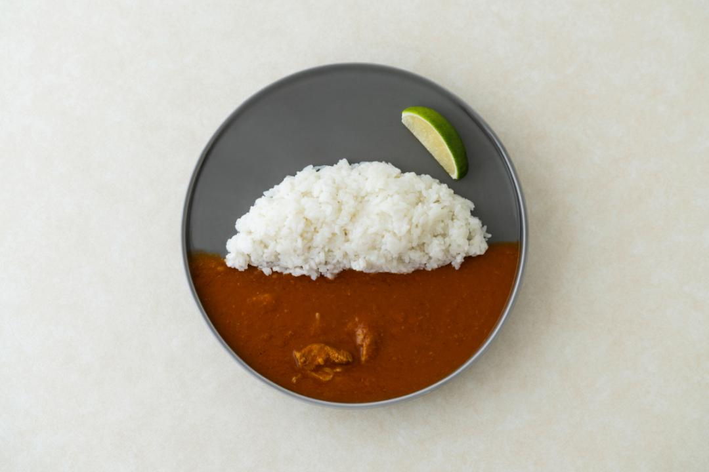
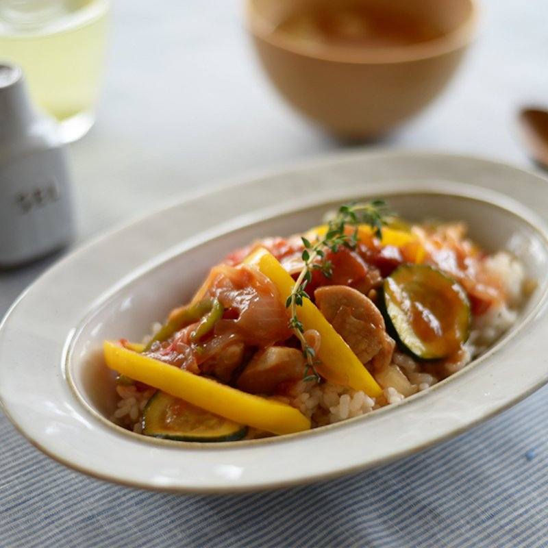

雖然這是個討論到爛掉的主題，但我覺得有必要梳理一下自己內心的激盪。

我一向自詡為「不拌派」的死忠支持者。直到某天，我突然發現自己下意識的將咖哩拌在一起，那一刻的震驚，我彷彿像是第一次認清自己的咖哩性向一樣，我竟然不是「**拌派/不拌派**」那麼單純，而是兩者皆可的「咖哩雙性戀」。

所以沒錯，這篇文章就是我的咖哩出櫃文。

## 重點在於容器阿！是容器！

經過深層的自我探索，我發現影響關鍵在於**容器**。如果使用盤子吃咖哩的話，想當然咖哩與白飯就必須要涇渭分明。用湯匙挖起一半的米飯，另一半再挖起咖哩，放入口中享受那美好的味覺饗宴；而視覺上也要像藝術品般優雅，配合米飯與醬汁的份量，直到最後一口都維持完美的配比。

*Photo by [kohan / 寺山紀彦](https://hi-zento.stores.jp/items/60dc4ba0a00a4a44561970e6)*

但是如果用碗裝的話，情況就完全不同了。當米飯盛入碗中，舀起咖哩醬汁淋上去，這時碗壁的限制，讓米飯早已是浸潤的狀態了，所以下意識的就會用湯匙順勢而下，裹滿醬汁後再把米飯送入口中，這一切就自然又合理了起來對吧！

*Photo by [STUDIO M'](https://www.studiom.tw/products/07100808)*

## 在咖哩之後

我現在要來糾察自己在其他食物上的性向了。

* 魯肉飯：碗裝限定，拌！
* 韓式拌飯：碗裝（不能違背他的命名阿），拌！
* 皮蛋豆腐：盤裝的優雅不容破壞，不拌！
* 雪花冰：碗裝，拌！
* 涼麵：碗裝和盤子裝都看過，但不拌能吃嗎？拌！

看來我的容器理論好像只有大部份說的通，涼麵就是個獨特的例外了，盤裝的我也是會拌耶。