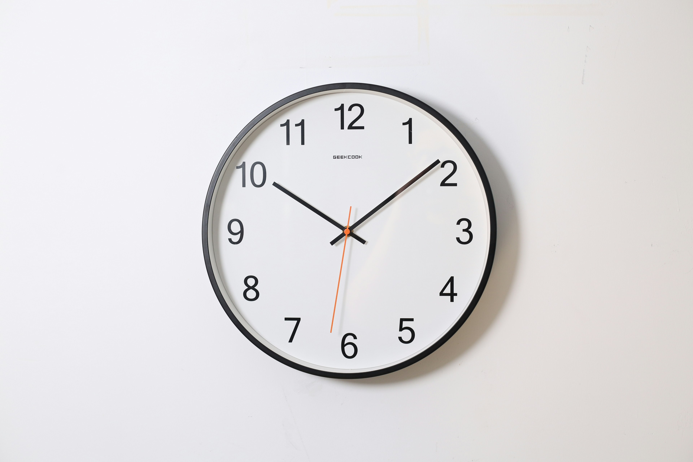

*Photo by <a href="https://unsplash.com/@oceanng?utm_source=unsplash&utm_medium=referral&utm_content=creditCopyText">Ocean Ng</a> on <a href="https://unsplash.com/photos/round-analog-wall-clock-pointing-at-1009-L0xOtAnv94Y?utm_source=unsplash&utm_medium=referral&utm_content=creditCopyText">Unsplash</a>*
      
剛才看到 ikuka 的這篇文章[〈指針式時鐘的必要性〉](https://ikukaroom.com/analog-clock/)，文章中提到有人不會看時鐘，我還不以為意的想說，怎麼可能有人不會看時鐘？突然竟識到有點不妙，就隨意搜尋了一下，找到這兩個影片：[〈Can Young People Read a Clock?〉](https://www.youtube.com/watch?v=ZvLKbhXqEKw)、[〈Kids Can't Tell Time Anymore〉](https://www.youtube.com/watch?v=PIe2auW9EMI)，真的快嚇死我了，這是整人節目吧！不過我還是抱持著非常大的懷疑，難道是國情的問題嗎？因為我這輩子真的從來沒有遇到過不會看時鐘的臺灣人。

現在的我真的有個衝動，拿著時鐘對著街上每一個路人：請問你能說出現在幾點嗎？