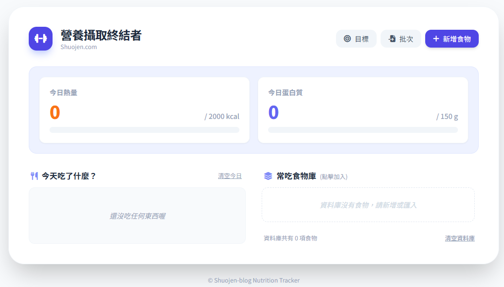

新工具：[營養攝取終結者](https://shuojen.com/calories)！

## 體檢

自從公司全身體檢後，發現體脂、尿酸、胰島素阻抗都紅字，我就決定開始認真一點做飲控了，並且運動量也再提高一點，變成每天中午有氧半小時，沒加班的話晚上重訓一小時。

## 飲食

現在我平日一到五的固定目標是

* 攝取體重兩倍克數的蛋白質
* 攝取熱量大約 1800 kcal 的輕微赤字

由於平日上班可以吃的比較固定，所以我打算做一個工具把常吃的食物做成一個食物庫，這樣每天快速點一下就可以知道有沒有達標了。

## 試用
目前先試用看看，應該就會知道有什麼需要調整的功能，雖然手機上一定有成堆做好的 APP 可以下載來用，但是我覺得自己用 AI 做一個放在自己的網頁上應該比較好玩，想要用的人也可以自己設定自己常吃的飲食，打開網址就可以用了。