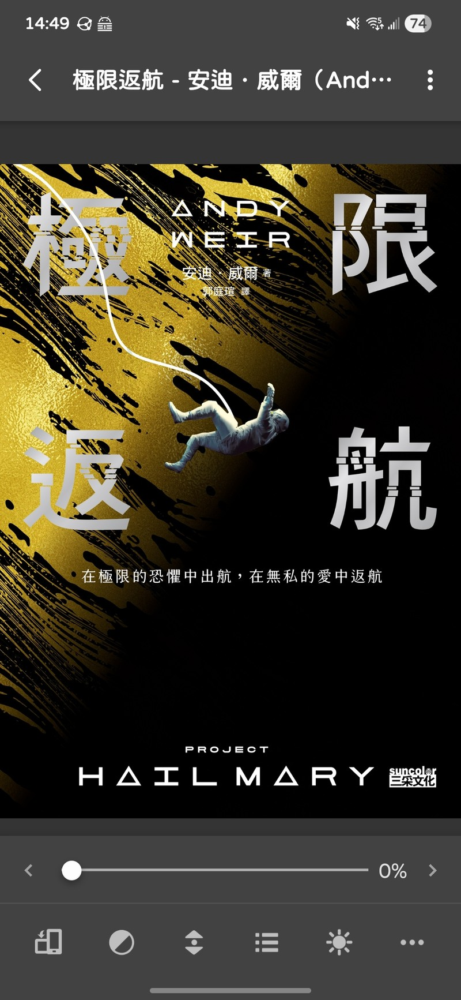

:::warning
移除電子書平台 DRM 可能有風險，使用前請自行評估，本人僅供個人自用。
:::
## 前言

 

先來推一下昨天看的午夜場電影[《極限返航》](https://zh.wikipedia.org/zh-tw/%E6%A5%B5%E9%99%90%E8%BF%94%E8%88%AA_(%E9%9B%BB%E5%BD%B1))。這部由小說改編的太空科幻電影表現不俗，與多數太空電影相同，為了拯救全人類，主角前往太空尋找一絲渺茫的機會，展開一段前所未有的冒險。

與大家熟知的星際效應比較的話，走的是一個完全不同的基調與角色塑造，極限返航更偏向一點詼諧輕鬆的氛圍，敘事採雙線性，分別交代過去與現在，一點一點的完整故事脈絡，角色很討喜，看完會覺得很暖，充滿希望。

## kobo-book-downloader

在電影版看評價時，非常多人提到小說更好看，許多地方描寫的更完整，科學方面也著墨的更嚴謹，讓我非常想購入電子書來閱讀。

我研究了許久如何能正版購買再移除 DRM，這樣我就可以用自己習慣的閱讀 APP 在手機上閱讀了！最後選擇了在 [kobo](https://www.kobo.com/tw/zh) 平台買書後，利用 github 的開源工具移除 DRM，非常簡單。 

移除 DRM 工具：[kobo-book-downloader](https://github.com/TnS-hun/kobo-book-downloader)

>With kobo-book-downloader you can download your purchased Kobo books and remove the Digital Rights Management (DRM) protection from them. 

## 安裝與使用步驟

1. 前置準備

確保電腦已安裝 Python 3。

2. 下載與安裝

取得程式碼，在 terminal 輸入：

```
git clone https://github.com/TnS-hun/kobo-book-downloader.git
```

進入資料夾：

```
cd kobo-book-downloader
```

安裝必要組件：

```
pip install -r requirements.txt
```

3. 下載無 DRM 版本的 epub 檔

列出所有書籍：

```
python kobo-book-downloader list --all
```

第一次使用畫面會出現一段 URL 網址，將該網址複製並貼到瀏覽器打開，在 Kobo 網頁登入後，將網頁上顯示的代碼（Code）輸入回終端機。


下載所有書籍：
```
python kobo-book-downloader list --all
```

下載特定書籍：
如果你知道書籍的 ID（可從 list 指令取得）：
```
python kobo-book-downloader get /儲存路徑/書名.epub 書籍ID
```

這樣就大功告成啦！最後我用 Syncthing 將所有的電子書都同步到手機上，可以用自己習慣的閱讀程式真的太棒拉。

學會這個方法後，我又加了好多本想看的書在購物車了，感謝開發者的努力，你們又再次拯救了我的世界！諷刺的是，在學會如何移除 DRM 之前，即使我想看，但我根本不想買有 DRM 的版本，DRM 到底擋掉的是真的會看盜版的人，還是真的願意消費支持的人？



最後關於使用移除 DRM 到底算不算盜版？我是覺得不算，付費後如何使用應該是我的基本權利才對，雖然嚴格說起來，這樣就是盜版沒錯，但在看了 Ivon 的這篇[〈隱私與盜版只有些微之差，看盜版總是受道德良心譴責〉](https://ivonblog.com/posts/privacy-and-piracy/)後，我決定

>壓力別太大，羞恥心的使用盜版就好了！
