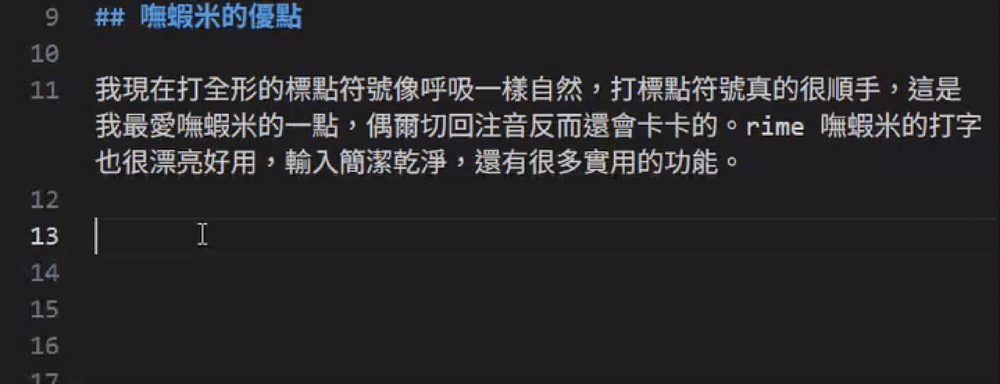

 

我從去年的 10/3 開始練習使用[嘸蝦米打字](/blog/2025/10/03/noshrimprice)，[練習幾天](/blog/2025/10/09/type)後開始可以打 18wpm 了，19 天後的「小王子」[練習成果](/blog/2025/10/22/type)是 35wpm，後來我都把嘸蝦米作為我使用電腦打字的主要輸入法，五個月左右過去了，現在的成績是 64wpm，其實還是沒有用注音打字那麼快，畢竟打了十幾年了，而且注音現在的選字其實非常準，一般使用上幾乎不會用到什麼生僻字，其實反而還更快，感覺自己嘸蝦米進度的幅度好慢呀。

## 嘸蝦米的優點

我現在打全形的標點符號像呼吸一樣自然，打標點符號真的很順手，這是我最愛嘸蝦米的一點，偶爾切回注音反而還會卡卡的。rime 嘸蝦米的打字也很漂亮好用，輸入簡潔乾淨，還有很多實用的功能。

~例如：用快捷鍵打出常用的幹話，也不是不行。~

 

## 所以到底要用哪個輸入法呢？

現在就維持現況兩個混著用吧，好希望快一點打嘸蝦米的速度超過我的注音阿！
                                                                                                                                                                                                                                                                                                                                                                                                                                                                                                                                                                                                 

