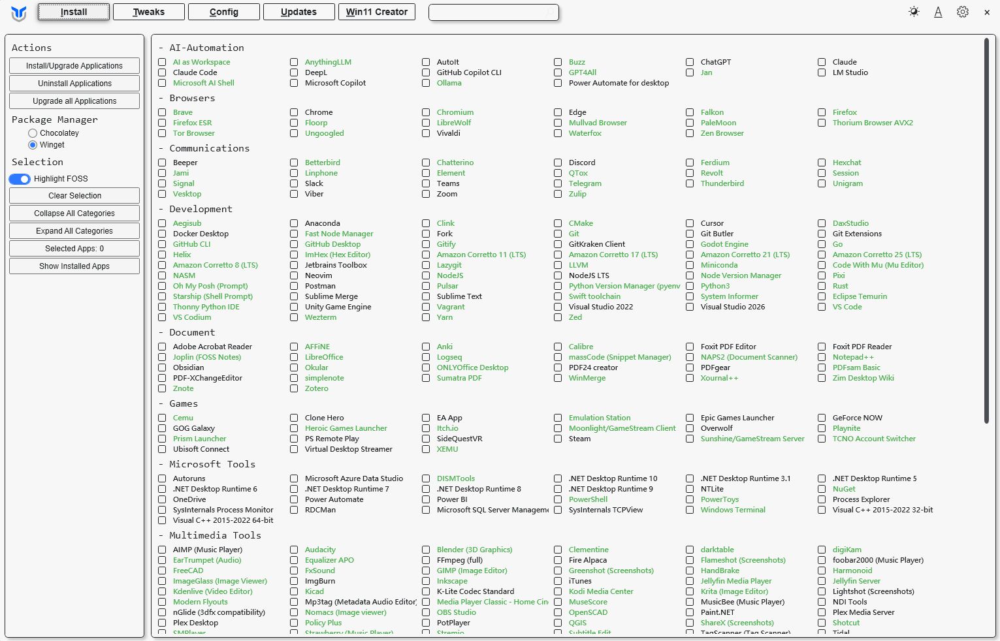

這是在 Windows 系統上一個由大佬 Chris Titus 開發的超好用開源工具：[Winutil](https://github.com/christitustech/winutil)，能一鍵去掉 Windows 煩人的追蹤、內建廣告、以及沒用的預裝軟體，還可以快速安裝很多實用應用，使用超簡易。

## 如何操作 WinUtil

**不需要下載安裝檔**，直接透過終端機就能執行，將指令完整複製並在 PowerShell 中貼上，然後按下 <kbd>Enter</kbd> 即可。


```
irm christitus.com/win | iex
```

## 核心功能

介面很乾淨簡潔，分為五個核心功能。

 

1. Install (軟體安裝)

它像是一個軟體商店的自動化面板，透過微軟官方的 `winget` 引擎，讓你勾選多個軟體後一鍵安裝， 自動跳過「下一步、下一步」的視窗，也不會被夾帶廣告軟體，裡面還有「Upgrade All」按鈕，幫你把電腦裡所有軟體一次升到最新版，也可以找到許多不錯的軟體喔。

2. Tweaks (系統優化)

修改登錄檔（Registry）和系統服務，來關閉不需要的功能，關閉微軟的數據追蹤，還可以強硬移除 Edge 和 Onedrive 等等煩人軟體，以及移除內建廣告。

3. Config (功能配置)

管理 Windows 選用功能（Optional Features）和特定的修復腳本，開啟或關閉 WSL，重設 Windows Update、修復損壞的系統檔案的快速修復工具。

4. Updates (更新管理)

可以將**功能更新**延遲 1 年，**安全性更新**延遲 4 天：基本的安全修補程式還是會裝，但會稍微晚幾天，以防剛發布的補丁有災情（我選 Security Settings）。

5. Win11 Creator (客製化安裝檔)

製作一個極致簡約版的 Windows 11 安裝映像檔 (ISO)。

## 我的 Tweaks 設定

## Essential Tweaks中

我選擇使用**Standard**，關掉沒用的後台監控，但不破壞系統功能（其中每一項都可以看到程式碼和作用）。

重要的幾項：

* Delete Temporary Files：阻止微軟在後台偷偷上傳使用數據，節省一點點 CPU 與網路資源。

* Set Services to Manual：把很多平常沒用到、卻開機就佔著記憶體的服務改成「有需要才啟動」

* Enable End Task With Right Click：軟體當掉，直接在工作列圖示按右鍵選「結束工作」就好，不用再開工作管理員。

## Advanced Tweaks 中

* Remove OneDrive：如果沒有在用微軟的雲端硬碟，把它刪掉會讓檔案總管乾淨很多，也不會在後台佔資源。

* Remove Microsoft Edge：欠刪的 Edge，在這裡勾選後跑一次 Run Tweaks，就掰掰啦。

* Disable Microsoft Copilot：這 AI 按鈕到底想幹嘛，趕快把它完整停用。

## Customize Preferences 中

* 建議開啟：

- [x] Dark Theme for Windows：可以將系統調成深色模式。

- [x] Detailed BSoD：系統當機會顯示具體的錯誤代碼。

- [x] Num Lock on Startup：開啟。這樣開機時小鍵盤數字鍵就是預設開啟的。

- [x] Show Hidden Files：開啟時可以看到隱藏檔。

- [x] Verbose Messages During Logon：開機時會顯示「正在載入服務...」之類的文字，讓你清楚知道電腦現在在幹嘛。

- [x] S3 Sleep：能避開 Win11 關不掉的「Modern Standby」問題。

* 建議關閉：

- [ ] Bing Search in Start Menu：絕對要關！這會讓開始功能表搜尋時，不會跳出一堆亂七八糟的網頁搜尋結果，搜尋速度也會變快。

- [ ] Recommendations in Start Menu：關閉會移除開始功能表下面那一區「推薦項目」，讓介面乾淨很多。

- [ ] Mouse Acceleration：建議關閉。關閉滑鼠加速能讓游標移動是「線性」的，手感更穩定，打 FPS 遊戲也通常會設定關掉。

- [ ] Cross-Device Resume：建議關閉。除非有好幾台電腦要同步開啟到一半的軟體，否則只是多餘的後台追蹤。

我主力用的系統還是 Windows，雖然沒有 Linux 那麼乾淨自由，但是小小設置一下就可以好用非常多，推薦給所有還在使用 Windows 的大家。


