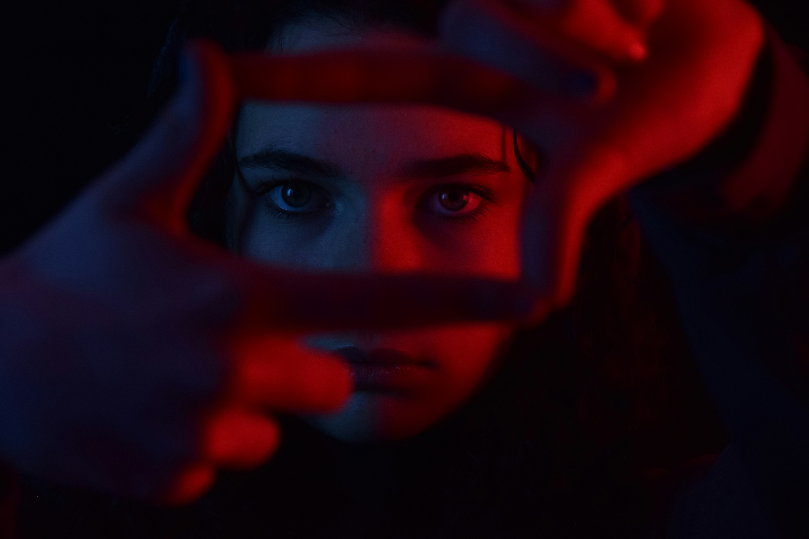

import MovieListApp from '@site/src/components/MovieListApp';
import Details from '@theme/Details';

 
*Photo by <a href="https://unsplash.com/@masonkimbar?utm_source=unsplash&utm_medium=referral&utm_content=creditCopyText">Mason  Kimbarovsky</a> on <a href="https://unsplash.com/photos/woman-in-black-framed-eyeglasses-t5l6CjGPeLQ?utm_source=unsplash&utm_medium=referral&utm_content=creditCopyText">Unsplash</a>*
      

最近不停在新增我的[興趣](/docs/intro)頁面裡的[電影推薦清單](/docs/movie_list)，我想要把我看過的所有電影都加進來這個評分制度，這真的是一個大工程阿，今天還找到了維基百科的[各年台灣電影作品列表](https://zh.wikipedia.org/wiki/Category:%E5%90%84%E5%B9%B4%E5%8F%B0%E7%81%A3%E9%9B%BB%E5%BD%B1%E4%BD%9C%E5%93%81%E5%88%97%E8%A1%A8)，把所有我看過的國片也一部一部放進來評分，這個過程很有趣，也讓我有幾個有趣的思考。

現在我還正在調整我的評分機制，慢慢修正我對所有電影的評價。

## 電影會不會有童年濾鏡

像是周星馳系列電影、吉卜力工作室的宮崎駿系列、皮克斯系列，這些都是我童年的最愛。研究指出，人的記憶是不可靠的，我們往往會美化記憶[^1]，那當我帶有這樣的意識，是不是就不夠準確了呢？

>「懷舊」其實是大腦的自保機制，特別是在認知到重大威脅、感到徬徨時，適時的懷舊感能幫助我們減輕壓力，甚至是降低當下經驗到的焦慮感。

這也解釋了一件事，很多經典老電影在 IMDB 等等評分網站，都有相當高的分數，但當我找來看時，常常會感到不如預期，雖然還是有完全不覺得過時的超棒老電影（例如 1942 年的《北非諜影》），所以當現在的我看老片時，我會降低一些標準，並接受節奏慢一點的步調，也會先預設這些電影的評價，帶有別人的童年濾鏡。

## 童年港片清單

當我整理到童年港片系列，真的太有回憶了。我記得看過一個新聞，周星馳電影每年電視台都重播上百次，小時候的我，經過那麼多年到後來串流時代才沒在看，這段時間下來也真的都看過上百次了，這些電影每部我都如數家珍，台詞也是倒背如流。

在求學的每個階段，我都會遇到幾個，跟我一樣能將周星馳電影台詞隨口就來的朋友，並且融入到對話中，樂此不疲，這些港片可以說是組成我這個人的一部份了，周星馳對我來說，就是我的比爾·莫瑞和卓別林。

以現今的標準來看，我不能說這些電影是人生必看的經典佳作，但我會把它們放在 7~8 分的好片。

周星馳電影真的很有趣，當我長大了，好像不覺得有小時候那麼好笑了，但是依然很好看，因為現在的我能看懂，這些電影大多都是一些悲劇，充滿很多霸凌、人生的起落、因果報應，通常這些周星馳演繹的小人物，經過奮鬥，最後會用無厘頭的方式通往 Happy ending 喜樂收尾。不過螢幕暗掉後，觀眾會發現，其實人生並沒有電影這麼容易。

喜劇的內核真的都是悲劇。

<MovieListApp initialFilter="hongkong" hideFilterBar={true} />

## 電影闡述的觀念會影響我的評價嗎？

當我記錄一些電影時，我產生了一個問題，**電影當中闡述的觀念會影響我的評價嗎？**

例如我在之前的[文章](/blog/2026/04/08/movie)中提到的[《手札情緣》*(The Notebook)*](https://zh.wikipedia.org/zh-tw/%E5%BF%98%E4%BA%86%E3%80%81%E5%BF%98%E4%B8%8D%E4%BA%86)，還有一部 2021 的國片[《當男人戀愛時》](https://zh.wikipedia.org/zh-tw/%E7%95%B6%E7%94%B7%E4%BA%BA%E6%88%80%E6%84%9B%E6%99%82_(2021%E5%B9%B4%E9%9B%BB%E5%BD%B1))，其實以劇本情節、演員演技、節奏架構而言，這兩部絕對都沒問題，甚至《手札情緣》我覺得很不錯，但是這兩部電影當中很多角色的行為、價值觀，我都覺得超級不能接受，這樣這到底是一部好電影、還是爛電影，實在是有點微妙。

有趣的是，在打分時，我是將分數打比較高的，但是當我在使用我自己的評分系統時，每次隨機二選一，我都不會選擇這些觀念不合的電影。

看來我不用騙自己了，其實主觀上我就真的覺得是爛片。

1. Ryan Reynolds 一開始就用超級恐怖情人的方式求約會，人帥真好。
2. 兩個人感情昇溫，談戀愛的方式是躺在馬路中間，到底？？？真的快笑死。
3. Rachel McAdams 的角色整部片都讓人很無語，離開未婚夫跑來找男主偷吃，然後說兩個人選哪一個都會有人受傷，超級欠打，未婚夫人真的超好。
4. Rachel McAdams 的媽媽坦白自己的經歷，然後自己一直以來，都對女兒做出各種過去的自己會痛苦的小動作，真的完全看不懂這個操作。
5. Ryan Reynolds 也是有點渣，但是之前就有坦誠過自己放不下，所以相比之下倒是還好。

## 後記

現在的我越整理越起勁，我開始想要整理我看過的動畫、漫畫，日韓美劇，將它們都用同一套系統打好分數，甚至是遊戲與音樂，我覺得把自己看過的作品都好好歸納收藏好，真的是一件超級有趣的事情！
      

[^1]:[《「貴古賤今」不是病，只是大腦美化記憶的濾鏡——為何我們需要「懷舊」的心理機制？》](https://pansci.asia/archives/329332)
