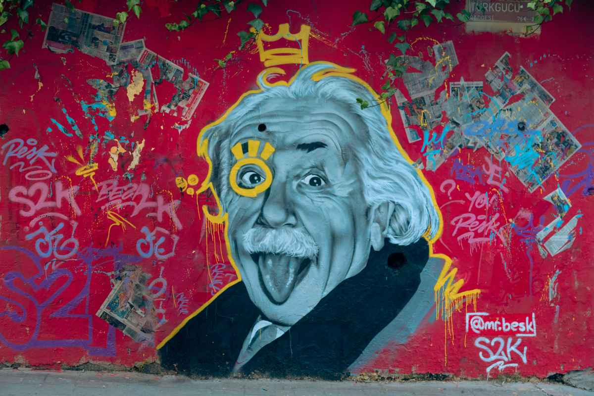

 

*Photo by <a href="https://unsplash.com/@collab_media?utm_source=unsplash&utm_medium=referral&utm_content=creditCopyText">Collab Media</a> on <a href="https://unsplash.com/photos/a-painting-of-a-man-with-a-surprised-look-on-his-face-g5wo-_XOzJI?utm_source=unsplash&utm_medium=referral&utm_content=creditCopyText">Unsplash</a>*

早上要起床上班的時候都會想，怎麼五分鐘過的那麼快，我還想再多睡一會；

晚上睡前總會驚覺，一小時怎麼一下就過完了，我還想再多休息一下再睡覺；

週日的最後總會嘆息，兩天的週末怎麼結束了，感覺都還沒有玩夠。

## 有意識的控制時間

>「當你和一位美女坐上一小時，你會覺得只過了一分鐘；但如果你坐在火爐上一分鐘，你會覺得過了一個小時。」
>
> -- Albert Einstein

時間的快慢真的很看體感，我覺得準確一點說，應該看當下的時間有多專注在某個事情上。平時的我上班都會開著通訊軟體，偶爾回回訊息，同時開著 email，每五分鐘就確認一下郵件，順便開著 RSS reader，隨時刷刷有沒有新文章，最近我就反過來在工作時實驗，很認真的處理事情，把所有干擾都移除，果然效率變得好好，而且也體感覺得時間變的好快。

不過這樣也滿消耗體力的，回家覺得好累阿，然後就又變回：一小時怎麼一下就過完了，我還想再多休息一下再睡覺！

