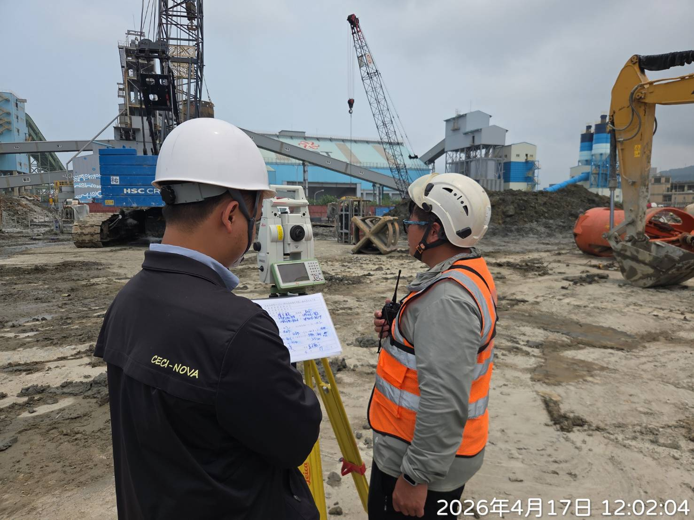
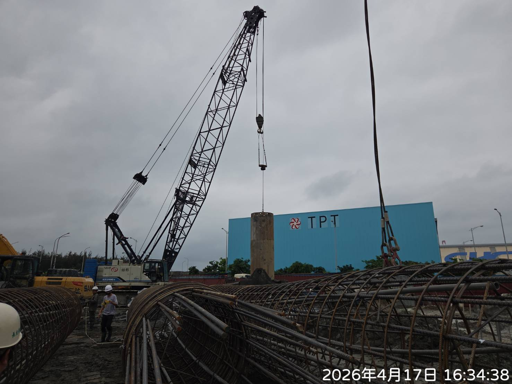
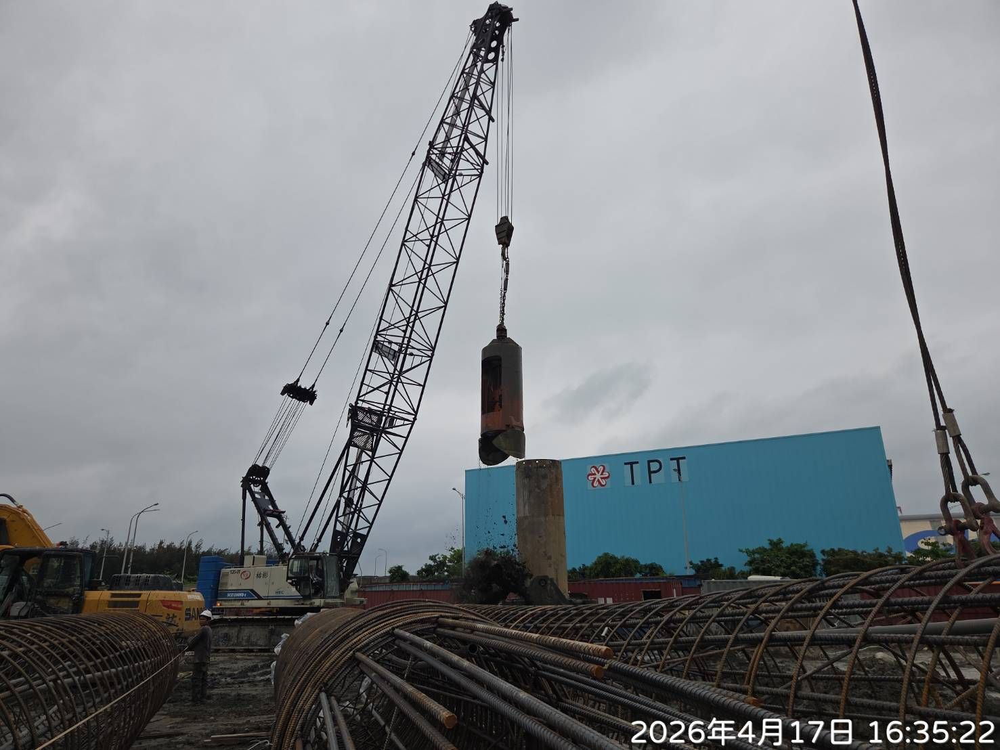
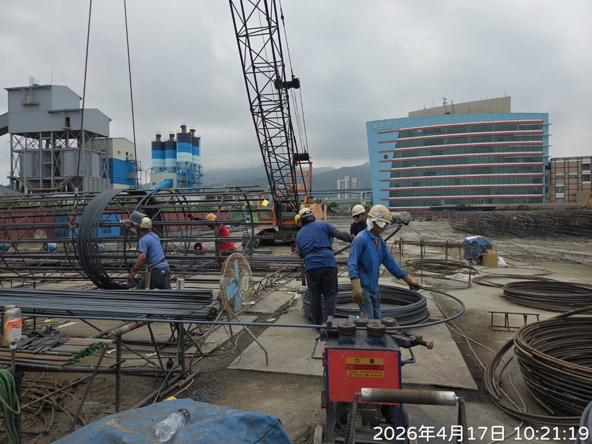
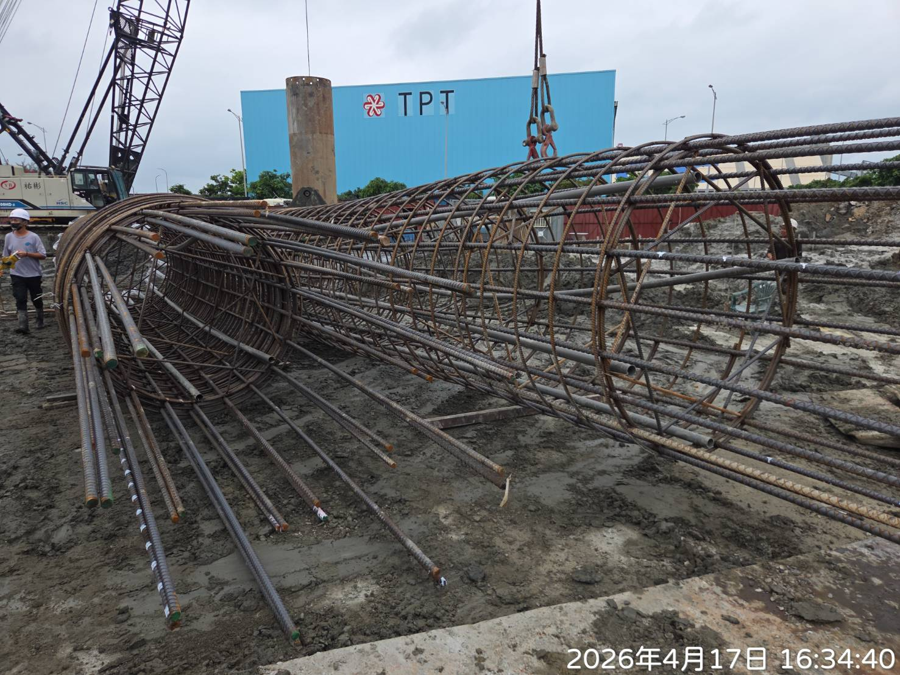
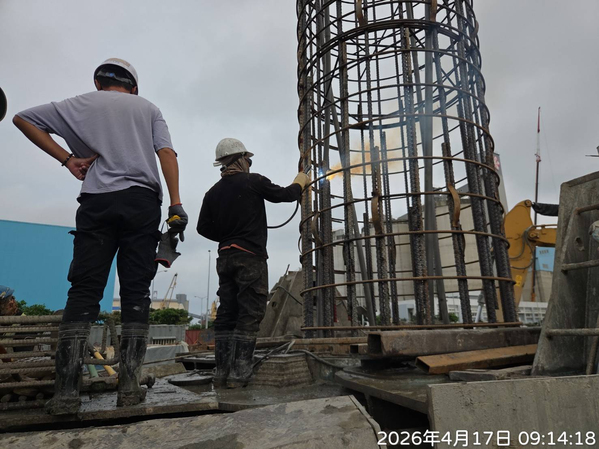
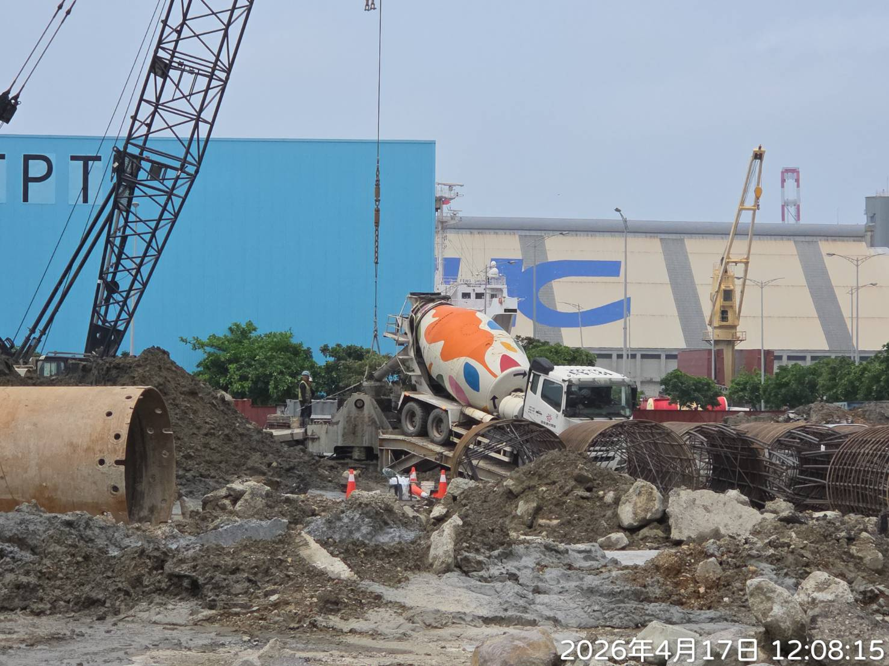
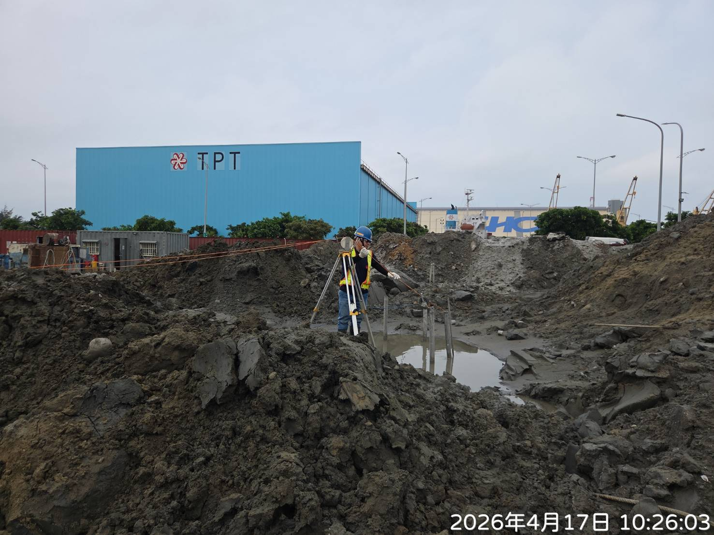
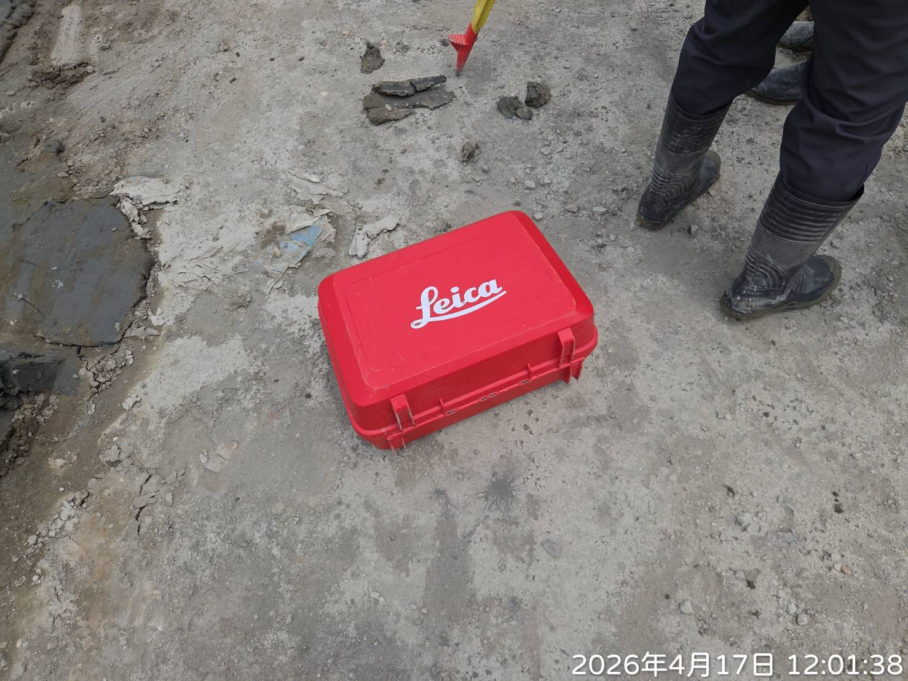

:::note
今天難得跑到工地，進行全套管基椿的施作查驗，以此記錄一下。

照片按整理後之施工流程呈現。
:::

## 簡述
全套管基樁是一種鑽掘樁基礎的種類，利用大型的搖管機具將鋼套管壓入土層，可以藉由管壁支撐住防止土壤崩塌，再以鯊魚夾在管內挖掘取土，接著吊放在地面上組立好的鋼筋籠並澆置混凝土，最後邊灌漿邊拔除套管，就完成一支基椿的打設了。

## 施工流程

▲ 以全測站儀器測量椿位

 
▲ 壓入鋼套管

 
▲ 鯊魚夾取土

  
▲ 組立鋼筋籠

 
▲ 查驗各段鋼筋籠的主筋支數、箍筋搭接長度、銲接長度、間距

 
▲ 吊裝鋼筋籠，查驗主筋搭接長度、焊道長度，護耳厚度與淨間距

 
▲ 澆灌混凝土，查驗混凝土試體、坍度、氯離子、溫度

 
▲ 留四支 PVC 管施作基椿完整性試驗

## 後記

在工地其實滿有意思的，可以看到很多設計與施作上的細節。題外話，工地都用 Leica 的儀器耶，我也想要一台 Leica 相機。

 

