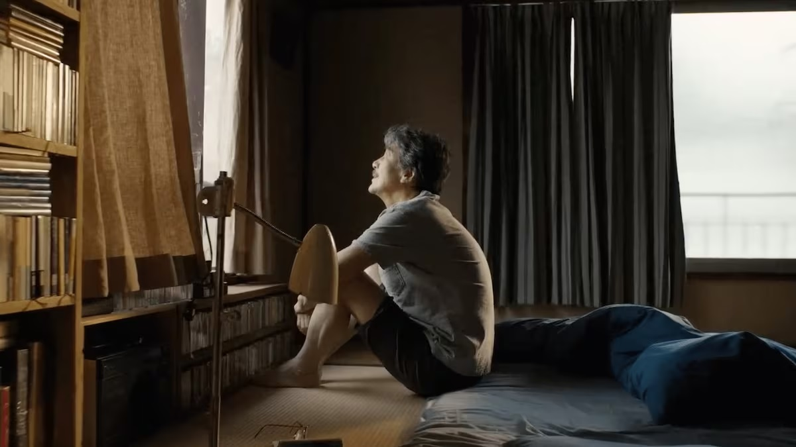

:::info
這是我的「[BlogBlog 同樂會 - 2026 年 5 月](https://blogblog.club/party/)」的投稿文章。本月主題是「[改變人生觀的一句話](https://eddielv.com/articles/a-sentence-changing-you/)」，由 [Eddie Lv](https://eddielv.com) 主持。如果你有自己的部落格，歡迎一起來參加！
:::

 
*[《我的完美日常》劇照](https://www.themoviedb.org/movie/976893-perfect-days/images/backdrops?language=en-US)*

我不是一個很在乎雞湯型名言佳句的人，但我很常在某些時刻被一些平實的話語給觸動到，這些話語有情境、有脈絡，有說話的人背後展現的故事，更容易觸動人心，當我受到感動和啟發，就會把這些話一直留存在心底。

>最好的報復，就是永遠不要報復。 
>
> ── 光頭哥哥[《林同學的訪問》](https://www.youtube.com/watch?v=TAdZX2ZponM)

## 光頭哥哥

我第一次認識到光頭哥哥，是大二的時候看到[《尋找紅心 A》](https://www.youtube.com/watch?v=bDrVVFAVLxE)的搞笑影片，影片拍攝的粗製濫造，但是卻非常有創意，一系列影片都讓人捧腹大笑，很推薦幾個有趣影片例如[《打乒乓球》](https://www.youtube.com/watch?v=frbTlZAkIOY&list=PL22tyVHp5DHzN5olbF0wEwDhaVw2726eT&index=6)、[《跳精武門》](https://www.youtube.com/watch?v=YlW8tEVm-aI&t=41s)、[《騎摩托車壓到狗》](https://www.youtube.com/watch?v=xGjIvpVDjN8&list=PL22tyVHp5DHzN5olbF0wEwDhaVw2726eT&index=5)，都超級強的，但這時的我也僅止於把光頭哥哥當作爆紅的娛樂笑料，沒有放在心上。

後來當我看到光頭哥哥這部影片，[《葛格唱你不是真正的快樂》](https://www.youtube.com/watch?v=LVbOFH5s_fA)，我感受到了很不一樣的東西，不知道為什麼，就莫名地流下眼淚。

2019/11/13，我在網路上看到光頭哥哥的家人發佈他病逝的消息。

在那之後，我又看了很多光頭哥哥的直播精華和 QA 影片（哥哥英文程度很好，有時候會在直播時回應外國網友的提問）以及眾多網友的整理。我才知道，光頭哥哥患有憂鬱症和自閉症，領有身障手冊，在家人的幫助下前往臺北榮總精神科看診，後來哥哥時常閱讀《聖經》，在宗教與治療下逐漸好轉。

光頭哥哥在[《林同學的訪問》](https://www.youtube.com/watch?v=TAdZX2ZponM)中，提到自己喜歡表演跟搞笑，起初是因為自己的一點虛榮心，但最終目的還是想要把歡樂帶給大家。哥哥的頻道不開贊助或廣告營利，他只是單純的希望大家能夠看了他的影片心情好一點。有人在直播上問過哥哥，做什麼工作？

>工作就是你看到的這樣，不太賺錢，但是心靈很富足。

有粉絲在光頭哥哥生前去找他一起拍影片，一起吃飯聊聊天：[《最真實的光頭哥哥與他的快樂鐵粉。 哥哥謝謝你..辛苦了....》](https://www.youtube.com/watch?v=cOC-6cpqmkA&list=PLEwXWI4AmFwgVn5C_Cwlpng5zX7JiZk-p)，可以看到他是個努力的人、幽默的人，也是個有智慧的人，他影響了我很多，我看到了一個人如何力抗自身的困境，如何無私無償的奉獻，我也在他的 QA 影片中，理解了寬恕的價值，寫這篇文章時，眼淚還是不由自主地掉下來，有些人離開了，但他還是會一直被懷念。

## 我的完美日常

在看電影《我的完美日常》的時候，我一直想到光頭哥哥。

主角做著不被多數人尊重的清掃工作，但他依舊勤奮努力，每每不受禮遇的時候，他也只是一笑置之。主角享受在自己的日常世界當中，那裏有搖滾樂、攝影、植栽與文學，不需要多麼雍容華貴的東西，卻可以讓自己的心靈如此富足，一個人的內在修養和光鮮亮麗的表象，其實真的沒有太多的關聯。

電影的最後幾分鐘，是一顆補捉演員役所廣司細微情緒的特寫鏡頭，他以這個神級演技，搭配 Nina Simone 的[〈Feeling Good〉](https://www.youtube.com/watch?v=oHRNrgDIJfo)，榮奪了第 76 屆坎城影展最佳男演員獎，我又想起了光頭哥哥唱你不是真正的快樂那個影片，揉合了自己一生故事的豐沛情緒，潰堤出來的樣子。

光頭哥哥在另一個世界裡，一定也是開著直播，說笑話，把歡笑傳播給大家，每天都過著富足的完美日常吧。

